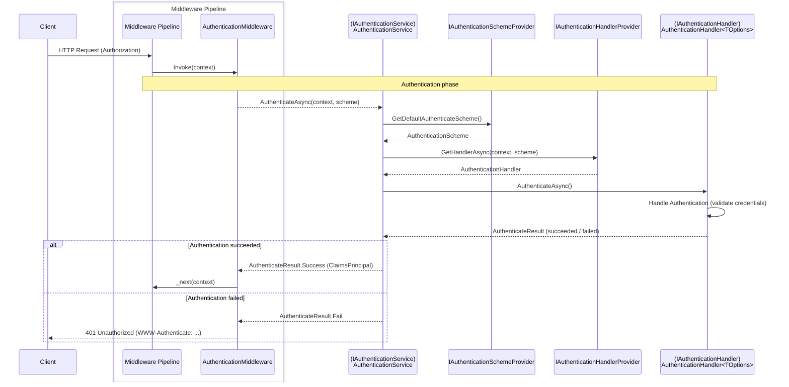
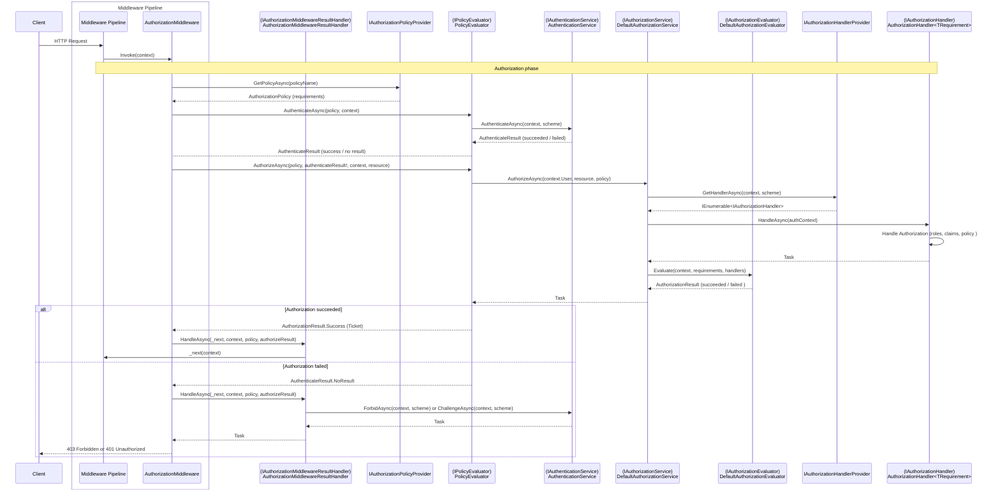

# Authentication and authorization in ASP.NET Core

## Table of Contents <!-- omit in toc -->

- [Authentication](#authentication)
  - [Authentication flow](#authentication-flow)
- [Authorization](#authorization)
  - [Authorization flow](#authorization-flow)

## Authentication

- [Overview of ASP.NET Core Authentication | Microsoft Learn](https://learn.microsoft.com/ja-jp/aspnet/core/security/authentication/)

### Authentication flow

## Authorization

- [Introduction to authorization in ASP.NET Core | Microsoft Learn](https://learn.microsoft.com/ja-jp/aspnet/core/security/authorization/introduction)

### Authorization flow

