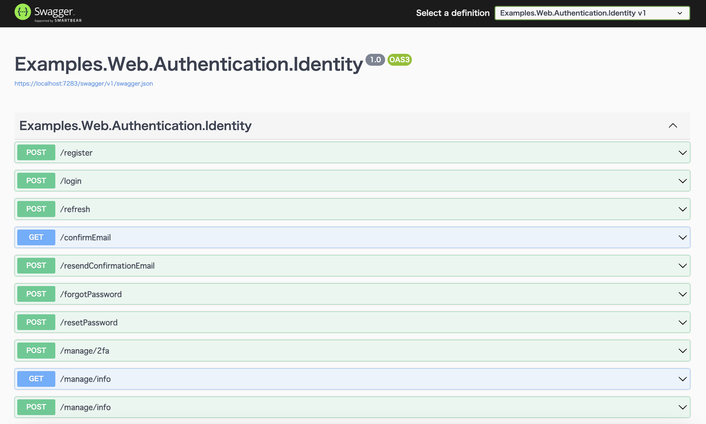

# Web API backend for SPAs

## Table of Contents <!-- omit in toc -->

- [Web API backend for SPAs](#web-api-backend-for-spas)
  - [References](#references)
  - [How to use Identity to secure a Web API backend for SPAs](#how-to-use-identity-to-secure-a-web-api-backend-for-spas)
    - [Add Swagger](#add-swagger)
    - [Add Api](#add-api)
    - [Add Identity services to the container](#add-identity-services-to-the-container)
    - [Activate Identity APIs](#activate-identity-apis)
    - [Map Identity routes](#map-identity-routes)
    - [Secure selected endpoints](#secure-selected-endpoints)
    - [Swagger UI](#swagger-ui)
    - [Add Log-out](#add-log-out)
    - [Move Path-base](#move-path-base)
  - [Will 401 not be returned if it coexists with the webapp?](#will-401-not-be-returned-if-it-coexists-with-the-webapp)
  - [Enable both IdentityConstants.BearerScheme and IdentityConstants.ApplicationScheme](#enable-both-identityconstantsbearerscheme-and-identityconstantsapplicationscheme)


## References

- [Use Identity to secure a Web API backend for SPAs | Microsoft Learn](https://learn.microsoft.com/en-us/aspnet/core/security/authentication/identity-api-authorization?view=aspnetcore-8.0)


## How to use Identity to secure a Web API backend for SPAs

### Add Swagger

```shell
dotnet add package Microsoft.AspNetCore.OpenApi
dotnet add package Swashbuckle.AspNetCore
```

```diff
--- a/src/Examples.Web.Authentication.Identity/Program.cs
+++ b/src/Examples.Web.Authentication.Identity/Program.cs
@@ -38,10 +38,18 @@
 
 builder.Services.AddControllersWithViews();
 
+builder.Services.AddEndpointsApiExplorer();
+builder.Services.AddSwaggerGen();
+
 var app = builder.Build();
 
 // Configure the HTTP request pipeline.
-if (!app.Environment.IsDevelopment())
+if (app.Environment.IsDevelopment())
+{
+    app.UseSwagger();
+    app.UseSwaggerUI();
+}
+else
 {
     app.UseExceptionHandler("/Home/Error");
     // The default HSTS value is 30 days. You may want to change this for production scenarios, see https://aka.ms/aspnetcore-hsts.
```

### Add Api

- [WeatherForecastApiExtensions.cs see ...](/src/Examples.Web.Authentication.Identity/Api/WeatherForecastApiExtensions.cs)

```diff
--- a/src/Examples.Web.Authentication.Identity/Program.cs
+++ b/src/Examples.Web.Authentication.Identity/Program.cs
@@ -4,6 +4,7 @@
 using Microsoft.Extensions.Configuration;
 using Microsoft.Extensions.DependencyInjection;
 using Microsoft.Extensions.Hosting;
+using Examples.Web.Authentication.Identity.Api;
 using Examples.Web.Infrastructure.Authentication.Identity;
 
 var builder = WebApplication.CreateBuilder(args);
@@ -69,4 +70,6 @@
     pattern: "{controller=Home}/{action=Index}/{id?}");
 app.MapRazorPages();
 
+app.MapWeatherForecastApi();
+
 app.Run();
```

### Add Identity services to the container

```diff
--- a/src/Examples.Web.Authentication.Identity/Program.cs
+++ b/src/Examples.Web.Authentication.Identity/Program.cs
@@ -35,6 +35,7 @@
         // https://docs.github.com/en/developers/apps/building-oauth-apps/scopes-for-oauth-apps
         githubOptions.Scope.Add("user:email");
     });
+builder.Services.AddAuthorization();
 
 builder.Services.AddControllersWithViews();
```

### Activate Identity APIs

By default, both cookies and proprietary tokens are activated

When coexisting with webapp?:

```diff
--- a/src/Examples.Web.Authentication.Identity/Infrastructure/Authentication/Identity/ServiceCollectionExtensions.cs
+++ b/src/Examples.Web.Authentication.Identity/Infrastructure/Authentication/Identity/ServiceCollectionExtensions.cs
@@ -31,7 +31,11 @@ public static class ServiceCollectionExtensions
 
         services.AddDefaultIdentity<IdentityUser>(options => options.SignIn.RequireConfirmedAccount = true)
             .AddEntityFrameworkStores<IdentityDataContext>()
-            .AddErrorDescriber<JapaneseErrorDescriber>();
+            .AddErrorDescriber<JapaneseErrorDescriber>()
+            .AddApiEndpoints();
+
+        services.AddAuthentication()
+            .AddBearerToken(IdentityConstants.BearerScheme);
 
         services.Configure<IdentityOptions>(options =>
         {
```

> I haven't set IdentityConstants.BearerAndApplicationScheme, I don't know if it's needed.

- [IdentityServiceCollectionExtensions.cs at main · dotnet/aspnetcore · GitHub](https://github.com/dotnet/aspnetcore/blob/main/src/Identity/Core/src/IdentityServiceCollectionExtensions.cs#L134)


### Map Identity routes

```diff
--- a/src/Examples.Web.Authentication.Identity/Program.cs
+++ b/src/Examples.Web.Authentication.Identity/Program.cs
@@ -1,5 +1,7 @@
 using System;
 using Microsoft.AspNetCore.Builder;
+using Microsoft.AspNetCore.Identity;
+using Microsoft.AspNetCore.Routing;
 using Microsoft.EntityFrameworkCore;
 using Microsoft.Extensions.Configuration;
 using Microsoft.Extensions.DependencyInjection;
@@ -70,6 +72,7 @@
     pattern: "{controller=Home}/{action=Index}/{id?}");
 app.MapRazorPages();
 
+app.MapIdentityApi<IdentityUser>();
 app.MapWeatherForecastApi();
 
 app.Run();
```

### Secure selected endpoints

To secure an endpoint, use the RequireAuthorization extension method on the Map{Method} call that defines the route.

```diff
--- a/src/Examples.Web.Authentication.Identity/Program.cs
+++ b/src/Examples.Web.Authentication.Identity/Program.cs
@@ -67,6 +67,8 @@
 app.MapRazorPages();
 
 app.MapIdentityApi<IdentityUser>();
-app.MapWeatherForecastApi();
+
+app.MapWeatherForecastApi()
+    .RequireAuthorization();

 app.Run();
```

Secure Swagger UI endpoints, as shown in the following example:

```cs
app.MapSwagger().RequireAuthorization();
```

### Swagger UI

An easy way to test authentication is to use the Swagger UI included in the project template.

- http://localhost:5140/swagger/



### Add Log-out

To provide a way for the user to log out, define a /logout endpoint like the following example:

- [IdentityApiExtensions.cs see ...](/src/Examples.Web.Authentication.Identity/Areas/Identity/Api/IdentityApiExtensions.cs)

```diff
--- a/src/Examples.Web.Authentication.Identity/Program.cs
+++ b/src/Examples.Web.Authentication.Identity/Program.cs
@@ -67,6 +67,7 @@
 app.MapRazorPages();
 
 app.MapIdentityApi<IdentityUser>();
+app.MapIdentityLogoutApi();
 
 app.MapWeatherForecastApi()
     .RequireAuthorization();
```

### Move Path-base

The default is direct, such as "/login", so I want a prefix.

```diff
--- a/src/Examples.Web.Authentication.Identity/Program.cs
+++ b/src/Examples.Web.Authentication.Identity/Program.cs
@@ -66,10 +66,13 @@
     pattern: "{controller=Home}/{action=Index}/{id?}");
 app.MapRazorPages();
 
-app.MapIdentityApi<IdentityUser>();
-app.MapIdentityLogoutApi();
+var api = app.MapGroup("/api");
 
-app.MapWeatherForecastApi()
+var auth = api.MapGroup("/auth");
+auth.MapIdentityApi<IdentityUser>();
+auth.MapIdentityLogoutApi();
+
+api.MapWeatherForecastApi()
     .RequireAuthorization();
 
 app.Run();
```

> I want to make it a little more beautiful


## Will 401 not be returned if it coexists with the webapp?

There is a feature in ASP.NET that automatically converts a 401 HTTP status code into a 302 redirect to the login page.

It seems to be quite famous.

For `application/json`, disable redirection:

```cs
public static class CookieAuthenticationOptionsExtensions
{
    public static CookieAuthenticationOptions UseUnauthorizedApiHandler(this CookieAuthenticationOptions options)
    {
        var onRedirectToLogin = options.Events.OnRedirectToLogin;

        options.Events.OnRedirectToLogin = context =>
        {
            if (context.Request.Headers.Any(x => x.Key == HeaderNames.Accept && x.Value == MediaTypeNames.Application.Json))
            {
                context.Response.StatusCode = StatusCodes.Status401Unauthorized;
                return Task.CompletedTask;
            }

            return onRedirectToLogin.Invoke(context);
        };

        return options;
    }

    public static CookieAuthenticationOptions UseForbiddenApiHandler(this CookieAuthenticationOptions options)
    {
        var onRedirectToAccessDenied = options.Events.OnRedirectToAccessDenied;

        options.Events.OnRedirectToAccessDenied = context =>
        {
            if (context.Request.Headers.Any(x => x.Key == HeaderNames.Accept && x.Value == MediaTypeNames.Application.Json))
            {
                context.Response.StatusCode = StatusCodes.Status403Forbidden;
                return Task.CompletedTask;
            }

            return onRedirectToAccessDenied.Invoke(context);
        };

        return options;
    }

}
```

```diff
--- a/src/Examples.Web.Authentication.Identity/Infrastructure/IdentityServiceCollectionExtensions.cs
+++ b/src/Examples.Web.Authentication.Identity/Infrastructure/IdentityServiceCollectionExtensions.cs
@@ -37,6 +37,11 @@ public static class ServiceCollectionExtensions
             .AddErrorDescriber<JapaneseErrorDescriber>()
             ;
 
+        services.ConfigureApplicationCookie(options => options
+            .UseUnauthorizedApiHandler()
+            .UseForbiddenApiHandler()
+            );
+
         services.Configure<IdentityOptions>(options =>
         {
             // Default Lockout settings.
```


## Enable both IdentityConstants.BearerScheme and IdentityConstants.ApplicationScheme

WebApp Identity has `IdentityConstants.ApplicationScheme`(Cookie) enabled.

However, when adding the WebAPI here, I tried to enable `IdentityConstants.BearerScheme` with `AddBearerToken(IdentityConstants.BearerScheme)`, but a 401 was returned, so I looked into how to deal with it.

Well, I don't think you need to use it that way.

First, create an authentication handler for branching.

Code for reference:
- https://github.com/dotnet/aspnetcore/blob/dc1acba9cd1374a8a8560bee655682e1a72de3eb/src/Identity/Core/src/IdentityServiceCollectionExtensions.cs#L134

```cs
    private sealed class CompositeAuthenticationHandler(IOptionsMonitor<AuthenticationSchemeOptions> options, ILoggerFactory logger, UrlEncoder encoder)
           : AuthenticationHandler<AuthenticationSchemeOptions>(options, logger, encoder)
    {
        protected override async Task<AuthenticateResult> HandleAuthenticateAsync()
        {
            var bearerResult = await Context.AuthenticateAsync(IdentityConstants.BearerScheme);

            // Only try to authenticate with the application cookie if there is no bearer token.
            if (!bearerResult.None)
            {
                return bearerResult;
            }

            // Cookie auth will return AuthenticateResult.NoResult() like bearer auth just did if there is no cookie.
            return await Context.AuthenticateAsync(IdentityConstants.ApplicationScheme);
        }
    }
```

Use `AddAuthentication()` to set the default key to the scheme for branching.<br>
Next, add an authentication handler for branching with `AddScheme`.<br>

The point is to set the `ForwardAuthenticate` option to `IdentityConstants.ApplicationScheme` instead of `IdentityConstants.BearerScheme`.

```diff
--- a/src/Examples.Web.Authentication.Identity/Infrastructure/IdentityServiceCollectionExtensions.cs
+++ b/src/Examples.Web.Authentication.Identity/Infrastructure/IdentityServiceCollectionExtensions.cs
@@ -37,6 +37,17 @@ public static class ServiceCollectionExtensions
             .AddErrorDescriber<JapaneseErrorDescriber>()
             ;
 
+        const string CompositeIdentityScheme = "CompositeIdentityScheme";
+        services.AddAuthentication(CompositeIdentityScheme)
+            .AddScheme<AuthenticationSchemeOptions, CompositeAuthenticationHandler>(CompositeIdentityScheme, null, options =>
+            {
+                // options.ForwardDefault = IdentityConstants.BearerScheme;
+                options.ForwardDefault = IdentityConstants.ApplicationScheme;
+                options.ForwardAuthenticate = CompositeIdentityScheme;
+            })
+            .AddBearerToken(IdentityConstants.BearerScheme)
+            ;
+
         services.ConfigureApplicationCookie(options => options
             .UseUnauthorizedApiHandler()
             .UseForbiddenApiHandler())
```

By the way, it seems that `IdentityConstants.BearerScheme` is not a JWT. 
[Officially](https://learn.microsoft.com/ja-jp/aspnet/core/security/authentication/identity-api-authorization?view=aspnetcore-8.0#use-token-based-authentication), this is said to be intentional.
