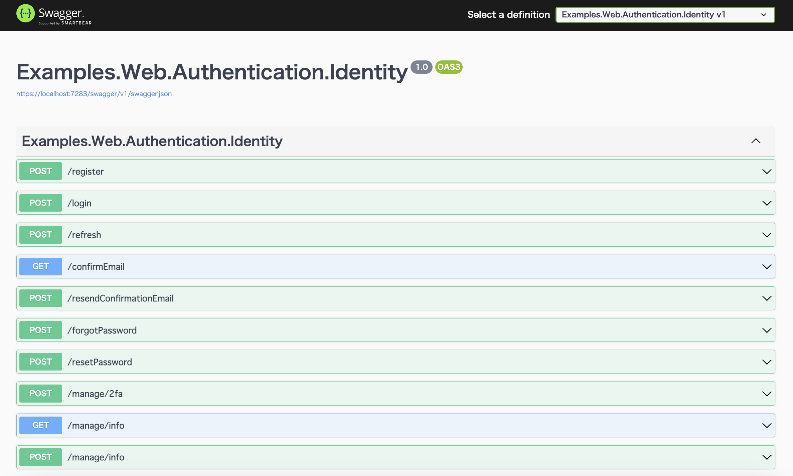
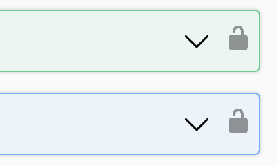
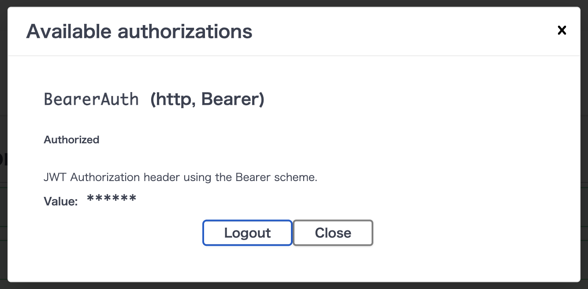
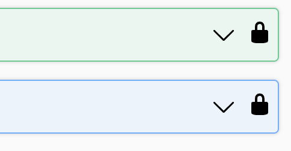

# ASP.NET Core Identity Web API backend for SPAs

## References

- [How to use Identity to secure a Web API backend for SPAs](https://learn.microsoft.com/en-us/aspnet/core/security/authentication/identity-api-authorization?view=aspnetcore-8.0)

## How to use Identity to secure a Web API backend for SPAs

### Add Swagger

```shell
dotnet add package Microsoft.AspNetCore.OpenApi
dotnet add package Swashbuckle.AspNetCore
```

```diff
--- a/src/Examples.Web.Authentication.Identity/Program.cs
+++ b/src/Examples.Web.Authentication.Identity/Program.cs
@@ -38,10 +38,18 @@
 
 builder.Services.AddControllersWithViews();
 
+builder.Services.AddEndpointsApiExplorer();
+builder.Services.AddSwaggerGen();
+
 var app = builder.Build();
 
 // Configure the HTTP request pipeline.
-if (!app.Environment.IsDevelopment())
+if (app.Environment.IsDevelopment())
+{
+    app.UseSwagger();
+    app.UseSwaggerUI();
+}
+else
 {
     app.UseExceptionHandler("/Home/Error");
     // The default HSTS value is 30 days. You may want to change this for production scenarios, see https://aka.ms/aspnetcore-hsts.
```

### Add Api

- [WeatherForecastApiExtensions.cs see ...](/src/Examples.Web.Authentication.Identity/Api/WeatherForecastApiExtensions.cs)

```diff
--- a/src/Examples.Web.Authentication.Identity/Program.cs
+++ b/src/Examples.Web.Authentication.Identity/Program.cs
@@ -4,6 +4,7 @@
 using Microsoft.Extensions.Configuration;
 using Microsoft.Extensions.DependencyInjection;
 using Microsoft.Extensions.Hosting;
+using Examples.Web.Authentication.Identity.Api;
 using Examples.Web.Infrastructure.Authentication.Identity;
 
 var builder = WebApplication.CreateBuilder(args);
@@ -69,4 +70,6 @@
     pattern: "{controller=Home}/{action=Index}/{id?}");
 app.MapRazorPages();
 
+app.MapWeatherForecastApi();
+
 app.Run();
```

### Add Identity services to the container

```diff
--- a/src/Examples.Web.Authentication.Identity/Program.cs
+++ b/src/Examples.Web.Authentication.Identity/Program.cs
@@ -35,6 +35,7 @@
         // https://docs.github.com/en/developers/apps/building-oauth-apps/scopes-for-oauth-apps
         githubOptions.Scope.Add("user:email");
     });
+builder.Services.AddAuthorization();
 
 builder.Services.AddControllersWithViews();
```

### Activate Identity APIs

By default, both cookies and proprietary tokens are activated

When coexisting with webapp?:

```diff
--- a/src/Examples.Web.Authentication.Identity/Infrastructure/Authentication/Identity/ServiceCollectionExtensions.cs
+++ b/src/Examples.Web.Authentication.Identity/Infrastructure/Authentication/Identity/ServiceCollectionExtensions.cs
@@ -31,7 +31,11 @@ public static class ServiceCollectionExtensions
 
         services.AddDefaultIdentity<IdentityUser>(options => options.SignIn.RequireConfirmedAccount = true)
             .AddEntityFrameworkStores<IdentityDataContext>()
-            .AddErrorDescriber<JapaneseErrorDescriber>();
+            .AddErrorDescriber<JapaneseErrorDescriber>()
+            .AddApiEndpoints();
+
+        services.AddAuthentication()
+            .AddBearerToken(IdentityConstants.BearerScheme);
 
         services.Configure<IdentityOptions>(options =>
         {
```

> I haven't set IdentityConstants.BearerAndApplicationScheme, I don't know if it's needed.

- [AddIdentityApiEndpoints<TUser>() see ...](https://github.com/dotnet/aspnetcore/blob/main/src/Identity/Core/src/IdentityServiceCollectionExtensions.cs#L134)

### Map Identity routes

```diff
--- a/src/Examples.Web.Authentication.Identity/Program.cs
+++ b/src/Examples.Web.Authentication.Identity/Program.cs
@@ -1,5 +1,7 @@
 using System;
 using Microsoft.AspNetCore.Builder;
+using Microsoft.AspNetCore.Identity;
+using Microsoft.AspNetCore.Routing;
 using Microsoft.EntityFrameworkCore;
 using Microsoft.Extensions.Configuration;
 using Microsoft.Extensions.DependencyInjection;
@@ -70,6 +72,7 @@
     pattern: "{controller=Home}/{action=Index}/{id?}");
 app.MapRazorPages();
 
+app.MapIdentityApi<IdentityUser>();
 app.MapWeatherForecastApi();
 
 app.Run();
```

### Secure selected endpoints

To secure an endpoint, use the RequireAuthorization extension method on the Map{Method} call that defines the route.

```diff
--- a/src/Examples.Web.Authentication.Identity/Api/WeatherForecastApiExtensions.cs
+++ b/src/Examples.Web.Authentication.Identity/Api/WeatherForecastApiExtensions.cs
@@ -26,7 +26,8 @@ public static WebApplication MapApiWeatherForecast(this WebApplication app)
             return forecast;
         })
         .WithName("GetWeatherForecast")
-        .WithOpenApi();
+        .WithOpenApi()
+        .RequireAuthorization();
 
         return app;
     }
```

Secure Swagger UI endpoints, as shown in the following example:

```cs
app.MapSwagger().RequireAuthorization();
```

### Test

An easy way to test authentication is to use the Swagger UI included in the project template.




> [ Will 401 not be returned if it coexists with the webapp? ](#will-401-not-be-returned-if-it-coexists-with-the-webapp)

### Log out

To provide a way for the user to log out, define a /logout endpoint like the following example:

- [IdentityApiExtensions.cs see ...](/src/Examples.Web.Authentication.Identity/Areas/Identity/Api/IdentityApiExtensions.cs)

### Change Path base

The default is direct, such as "/login", so I want a prefix.

```diff
--- a/src/Examples.Web.Authentication.Identity/Program.cs
+++ b/src/Examples.Web.Authentication.Identity/Program.cs
@@ -72,8 +72,9 @@
     pattern: "{controller=Home}/{action=Index}/{id?}");
 app.MapRazorPages();
 
-app.MapIdentityApi<IdentityUser>();
-app.MapIdentityLogoutApi();
+var identity = app.MapGroup("/api/identity");
+identity.MapIdentityApi<IdentityUser>();
+identity.MapIdentityLogoutApi();
 
 app.MapWeatherForecastApi();
```

> I want to make it a little more beautiful

## Swagger UI Configuration

- [Add Security Definitions and Requirements for Bearer auth](https://github.com/domaindrivendev/Swashbuckle.AspNetCore?tab=readme-ov-file#add-security-definitions-and-requirements-for-bearer-auth)

### AddSecurityDefinition

```cs
    services.AddSwaggerGen(options =>
    {
        options.AddSecurityDefinition("bearerAuth", new OpenApiSecurityScheme
        {
            Type = SecuritySchemeType.ApiKey,
            Name = "Authorization",
            In = ParameterLocation.Header,
            Description = "JWT Authorization header using the Bearer scheme. Example: \"Bearer {token}\""
        });

        options.OperationFilter<AuthenticationRequestOperationFilter>("bearerAuth");
    }
```

- [AuthenticationRequestOperationFilter see...](/src/Examples.Web.Infrastructure/Infrastructure/Swagger/AuthenticationRequestOperationFilter.cs)

### Test

The state before login is unlocked.



When you log in after obtaining a separate token...



The lock will close.




## Will 401 not be returned if it coexists with the webapp?

There is a feature in ASP.NET that automatically converts a 401 HTTP status code into a 302 redirect to the login page.

It seems to be quite famous.

```diff
--- a/src/Examples.Web.Authentication.Identity/Infrastructure/Authentication/Identity/ServiceCollectionExtensions.cs
+++ b/src/Examples.Web.Authentication.Identity/Infrastructure/Authentication/Identity/ServiceCollectionExtensions.cs
@@ -43,6 +46,33 @@ public static class ServiceCollectionExtensions
         services.AddAuthentication()
             .AddBearerToken(IdentityConstants.BearerScheme);
 
+        services.ConfigureApplicationCookie(options =>
+        {
+            var onRedirectToLogin = options.Events.OnRedirectToLogin;
+            options.Events.OnRedirectToLogin = context =>
+            {
+                if (context.Request.Headers.Any(x => x.Key == HeaderNames.Accept && x.Value == "application/json"))
+                {
+                    context.Response.StatusCode = StatusCodes.Status401Unauthorized;
+                    return Task.CompletedTask;
+                }
+
+                return onRedirectToLogin.Invoke(context);
+            };
+
+            var onRedirectToAccessDenied = options.Events.OnRedirectToAccessDenied;
+            options.Events.OnRedirectToAccessDenied = context =>
+            {
+                if (context.Request.Headers.Any(x => x.Key == HeaderNames.Accept && x.Value == "application/json"))
+                {
+                    context.Response.StatusCode = StatusCodes.Status403Forbidden;
+                    return Task.CompletedTask;
+                }
+
+                return onRedirectToAccessDenied.Invoke(context);
+            };
+        });
+
         services.Configure<IdentityOptions>(options =>
         {
             // Default Lockout settings.
```
