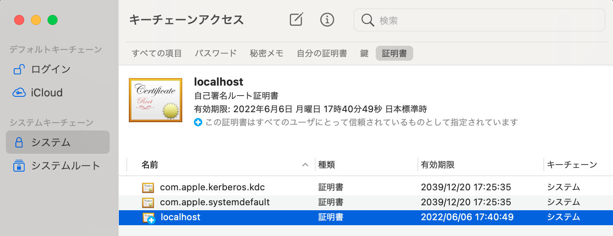

# Host on MacOS Over HTTPS

## Environments

- macOS Big Sur (11.4)
- OpenSSL 1.1.1k 25 Mar 2021

## Create Self-signed Certificate

### Use dotnet dev-certs https

[公式の説明](https://docs.microsoft.com/ja-jp/aspnet/core/security/docker-compose-https?view=aspnetcore-5.0)では dotnet コマンドで行っています。<br>
せっかく dotnet SDK をコンテナ内に閉じ込めたのに外側にインストールする必要があります。

```shell
dotnet dev-certs https -ep %USERPROFILE%\.aspnet\https\aspnetapp.pfx -p { password here }
dotnet dev-certs https --trust
```

### Use OpenSSL

OpenSSL で自己署名証明書を作成して自分でキーチェインに追加することでも実行できました。

> 公式に記載された方法ではないので、自己責任でお願いします。
> It is not an officially stated method, so please do so at your own risk.

Homebrew で OpenSSL をインストールします。Mac 標準は LibreSSL で完全互換ではなさそうです。

```shell
brew install openssl
```

LibreSSL ではなく OpenSSL を使用するよう PATH 設定します。

```shell
export PATH="/usr/local/opt/openssl@1.1/bin:$PATH"
```

ディレクトリを用意します。

```
mkdir -p ~/.dotnet/https
cd ~/.dotnet/https
```

[Micorosoft のサイト](https://docs.microsoft.com/ja-jp/dotnet/core/additional-tools/self-signed-certificates-guide#with-openssl)のコマンドで.crt と .key 作成します。

```shell
PARENT="localhost"
openssl req \
-x509 \
-newkey rsa:4096 \
-sha256 \
-days 365 \
-nodes \
-keyout $PARENT.key \
-out $PARENT.crt \
-subj "/CN=${PARENT}" \
-extensions v3_ca \
-extensions v3_req \
-config <( \
  echo '[req]'; \
  echo 'default_bits= 4096'; \
  echo 'distinguished_name=req'; \
  echo 'x509_extension = v3_ca'; \
  echo 'req_extensions = v3_req'; \
  echo '[v3_req]'; \
  echo 'basicConstraints = CA:FALSE'; \
  echo 'keyUsage = nonRepudiation, digitalSignature, keyEncipherment'; \
  echo 'subjectAltName = @alt_names'; \
  echo '[ alt_names ]'; \
  echo "DNS.1 = ${PARENT}"; \
  echo "IP.1 = 127.0.0.1"; \
  echo '[ v3_ca ]'; \
  echo 'subjectKeyIdentifier=hash'; \
  echo 'authorityKeyIdentifier=keyid:always,issuer'; \
  echo 'basicConstraints = critical, CA:TRUE, pathlen:0'; \
  echo 'keyUsage = critical, cRLSign, keyCertSign'; \
  echo 'extendedKeyUsage = serverAuth, clientAuth')
```

.crt の内容は次のコマンドで確認します。

```shell
openssl x509 -noout -text -in $PARENT.crt
```

.pfx を作成します。
ここでパスワードフレーズが必要になります。

```shell
openssl pkcs12 -export -out $PARENT.pfx -inkey $PARENT.key -in $PARENT.crt
```

キーチェーンへ CA 証明書を登録します。

```shell
sudo security add-trusted-cert -d -r trustRoot -k /Library/Keychains/System.keychain $PARENT.crt
```

.key .crt は消しておきます。

```shell
rm *.key *.crt
```

キーチェーンアクセスから登録内容を確認します。

```shell
open -a "Keychain Access.app"
```

証明書タブに追加されています。



## Configuration Docker Compose

`docker-compose.yml` で `ASPNETCORE_` 環境変数を設定します。
ローカルの証明書へは ro でバインドしています。

```yaml:docker-compose.yml
version: "3"
services:
  dev:
    build:
      context: ./
      args:
        # For Linux, Change the permission by specifying UID / GID.
        "USER_UID": ${VSCODE_UID:-1000}
        "USER_GID": ${VSCODE_GID:-1000}
    tty: true
    environment:
      - ASPNETCORE_ENVIRONMENT=Development
      - ASPNETCORE_URLS=https://+:5001
      - ASPNETCORE_Kestrel__Certificates__Default__Password={ password }
      - ASPNETCORE_Kestrel__Certificates__Default__Path=/https/localhost.pfx
    volumes:
      - ..:/workspaces
      - ~/.aspnet/https:/https:ro
```

## Note the LISTEN address.

ここまでで実行するとコンテナの外からアクセスできるはずだったが、なぜか接続できない。

curl もだめ

```console
% curl --insecure https://localhost:5001
curl: (7) Failed to connect to localhost port 5001: Connection refused
```

openssl ではこんな感じ

```console
% openssl s_client -connect localhost:5001 -msg
...
---

HTTP/1.1 400 Bad Request
Connection: close
Date: Sun, 06 Jun 2021 09:15:44 GMT
Server: Kestrel
Content-Length: 0

read:errno=0
>>> TLS 1.2 Alert [length 0002], warning close_notify
    01 00
```

LESTEN アドレスが localhost のみになっていることに気づきました。

```console
$ ss -ltn
State       Recv-Q      Send-Q           Local Address:Port            Peer Address:Port
LISTEN      0           1024                127.0.0.11:32963                0.0.0.0:*
LISTEN      0           512                  127.0.0.1:5000                 0.0.0.0:*
LISTEN      0           512                  127.0.0.1:5001                 0.0.0.0:*
LISTEN      0           511                          *:33145                      *:*
```

よくみるとログにも出ています。

```log
09:14:28.085+00:00|address=https://localhost:5001, interfaceName=IPv6 loopback, error=Cannot assign requested address
09:14:28.097+00:00|address=http://localhost:5000, interfaceName=IPv6 loopback, error=Cannot assign requested address
09:14:28.109+00:00|address=https://localhost:5001
09:14:28.134+00:00|address=http://localhost:5000
09:14:28.149+00:00|
09:14:28.203+00:00|envName=Development
09:14:28.237+00:00|contentRoot=/workspaces/src/ExamplesWebApi
```

ここで環境変数 `ASPNETCORE_URLS` が効いていないことにきづきました。
それでいろいろ調べると `launchSettings.json` にこんな記述が・・・

```json:launchSettings.json
    "ExamplesWebApi": {
      "commandName": "Project",
      "dotnetRunMessages": "true",
      "launchBrowser": true,
      "launchUrl": "swagger",
      "applicationUrl": "https://localhost:5001;http://localhost:5000",
      "environmentVariables": {
        "ASPNETCORE_ENVIRONMENT": "Development"
      }
    }
```

これを "" にすることによって、`ASPNETCORE_URLS` が有効になり、外部から接続できるようになりました。

```console
% curl --insecure  https://localhost:5001/swagger/v1/swagger.json
...
```
