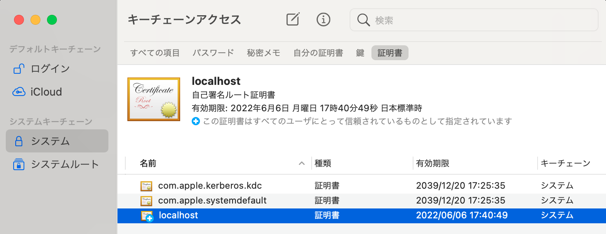

# Dev Containers HTTPS host on MacOS

## Table of Contents <!-- omit in toc -->

- [Dev Containers HTTPS host on MacOS](#dev-containers-https-host-on-macos)
  - [Environments](#environments)
  - [Create Self-signed Certificate](#create-self-signed-certificate)
    - [Use dotnet dev-certs https](#use-dotnet-dev-certs-https)
    - [Use OpenSSL](#use-openssl)
  - [Configurations](#configurations)
    - [Configuration `docker-compose.yml`](#configuration-docker-composeyml)
    - [Configuration the LISTEN address.](#configuration-the-listen-address)

## Environments

- macOS Big Sur (11.4)
- OpenSSL 1.1.1k 25 Mar 2021


## Create Self-signed Certificate

### Use dotnet dev-certs https

[Official explanation](https://docs.microsoft.com/ja-jp/aspnet/core/security/docker-compose-https?view=aspnetcore-5.0) uses the dotnet command.

Even though we have taken the trouble to confine the dotnet SDK inside the container, we still need to install it outside.

```shell
dotnet dev-certs https -ep %USERPROFILE%\.aspnet\https\aspnetapp.pfx -p { password here }
dotnet dev-certs https --trust
```

### Use OpenSSL

I was also able to do this by creating a self-signed certificate with OpenSSL and adding it to the keychain myself.

> It is not an officially stated method, so please do so at your own risk.

The Mac standard is LibreSSL, so compatibility seems to be an issue. 

Install OpenSSL using Homebrew:

```shell
brew install openssl
```

Set your PATH to use OpenSSL instead of LibreSSL:

```shell
export PATH="/usr/local/opt/openssl@1.1/bin:$PATH"
```

Prepare a directory:

```shell
mkdir -p ~/.aspnet/https
cd ~/.aspnet/https
```

Create `.crt` and `.key` files using the command on the [Micorosoft site](https://docs.microsoft.com/ja-jp/dotnet/core/additional-tools/self-signed-certificates-guide#with-openssl).

```shell
PARENT="localhost"
openssl req \
-x509 \
-newkey rsa:4096 \
-sha256 \
-days 365 \
-nodes \
-keyout $PARENT.key \
-out $PARENT.crt \
-subj "/CN=${PARENT}" \
-extensions v3_ca \
-extensions v3_req \
-config <( \
  echo '[req]'; \
  echo 'default_bits= 4096'; \
  echo 'distinguished_name=req'; \
  echo 'x509_extension = v3_ca'; \
  echo 'req_extensions = v3_req'; \
  echo '[v3_req]'; \
  echo 'basicConstraints = CA:FALSE'; \
  echo 'keyUsage = nonRepudiation, digitalSignature, keyEncipherment'; \
  echo 'subjectAltName = @alt_names'; \
  echo '[ alt_names ]'; \
  echo "DNS.1 = ${PARENT}"; \
  echo "IP.1 = 127.0.0.1"; \
  echo '[ v3_ca ]'; \
  echo 'subjectKeyIdentifier=hash'; \
  echo 'authorityKeyIdentifier=keyid:always,issuer'; \
  echo 'basicConstraints = critical, CA:TRUE, pathlen:0'; \
  echo 'keyUsage = critical, cRLSign, keyCertSign'; \
  echo 'extendedKeyUsage = serverAuth, clientAuth')
```

Verify the contents of the `.crt` file with the following command:

```shell
openssl x509 -noout -text -in $PARENT.crt
```

Create a PKCS12 `.pfx`:

```shell
openssl pkcs12 -export -out $PARENT.pfx -inkey $PARENT.key -in $PARENT.crt

# You will need your password phrase here.

```

Register the CA certificate to the `Keychain Access.app`:

```shell
sudo security add-trusted-cert -d -r trustRoot -k /Library/Keychains/System.keychain $PARENT.crt
```

Delete `.key` `.crt`:

```shell
rm *.key *.crt
```

Check the registration details from the `Keychain Access.app`:

```shell
open -a "Keychain Access.app"
```

Added to the Certificates tab.



<!-- ----- -->

## Configurations

### Configuration `docker-compose.yml`

Set the `ASPNETCORE_` environment variable in `docker-compose.yml`.
Bind to local certificate with ro.

`docker-compose.yml`:

```yaml:docker-compose.yml
version: "3"
services:
  dev:
    build:
      context: ./
      args:
        # For Linux, Change the permission by specifying UID / GID.
        "USER_UID": ${VSCODE_UID:-1000}
        "USER_GID": ${VSCODE_GID:-1000}
    tty: true
    environment:
      - ASPNETCORE_ENVIRONMENT=Development
      - ASPNETCORE_URLS=https://+:5001
      - ASPNETCORE_Kestrel__Certificates__Default__Password={ password }
      - ASPNETCORE_Kestrel__Certificates__Default__Path=/https/localhost.pfx
    volumes:
      - ..:/workspaces
      - ~/.aspnet/https:/https:ro
```


### Configuration the LISTEN address.

I was supposed to be able to access it from outside the container, but for some reason I can't connect.

```console
% curl --insecure https://localhost:5001
curl: (7) Failed to connect to localhost port 5001: Connection refused
```

openssl looks like this:

```console
% openssl s_client -connect localhost:5001 -msg
...
---

HTTP/1.1 400 Bad Request
Connection: close
Date: Sun, 06 Jun 2021 09:15:44 GMT
Server: Kestrel
Content-Length: 0

read:errno=0
>>> TLS 1.2 Alert [length 0002], warning close_notify
    01 00
```

While investigating, I noticed that the LESTEN address was only localhost.

```console
$ ss -ltn
State       Recv-Q      Send-Q           Local Address:Port            Peer Address:Port
LISTEN      0           1024                127.0.0.11:32963                0.0.0.0:*
LISTEN      0           512                  127.0.0.1:5000                 0.0.0.0:*
LISTEN      0           512                  127.0.0.1:5001                 0.0.0.0:*
LISTEN      0           511                          *:33145                      *:*
```

It was also in the log.

```log
09:14:28.085+00:00|address=https://localhost:5001, interfaceName=IPv6 loopback, error=Cannot assign requested address
09:14:28.097+00:00|address=http://localhost:5000, interfaceName=IPv6 loopback, error=Cannot assign requested address
09:14:28.109+00:00|address=https://localhost:5001
09:14:28.134+00:00|address=http://localhost:5000
09:14:28.149+00:00|
09:14:28.203+00:00|envName=Development
09:14:28.237+00:00|contentRoot=/workspaces/src/ExamplesWebApi
```

If you look into it further.

I noticed that the environment variable `ASPNETCORE_URLS` was overwritten by `applicationUrl` in `launchSettings.json` and was not working.

```json:launchSettings.json
    "ExamplesWebApi": {
      "commandName": "Project",
      "dotnetRunMessages": "true",
      "launchBrowser": true,
      "launchUrl": "swagger",
      "applicationUrl": "https://localhost:5001;http://localhost:5000",
      "environmentVariables": {
        "ASPNETCORE_ENVIRONMENT": "Development"
      }
    }
```
By setting this to "", `ASPNETCORE_URLS` is enabled and connections can be made from outside.

```console
% curl --insecure  https://localhost:5001/swagger/v1/swagger.json
...
```
