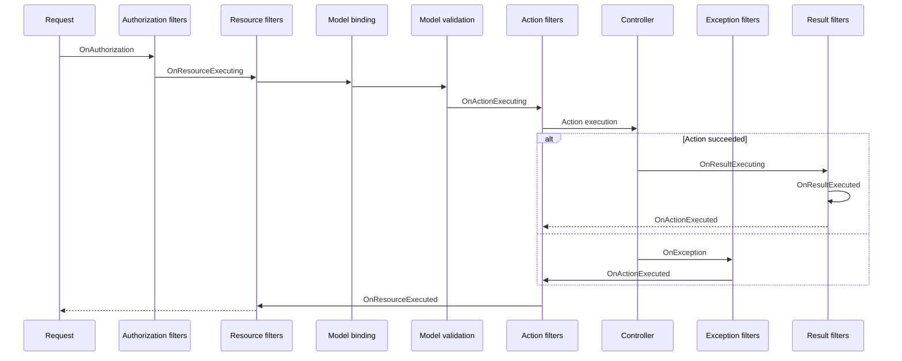

# Filters in ASP.NET Core

## Table of Contents <!-- omit in toc -->

- [Filters in ASP.NET Core](#filters-in-aspnet-core-1)
  - [Filter pipeline execution order](#filter-pipeline-execution-order)
  - [Filter types](#filter-types)
  - [Filter Attributes](#filter-attributes)
- [Implementation](#implementation)
- [References](#references)

## Filters in ASP.NET Core

Filters in ASP.NET Core allow code to run before or after specific stages in the request processing pipeline.

### Filter pipeline execution order



### Filter types

Each filter type is executed at a different stage in the filter pipeline:

- Authorization filters:
  - > Run first.
  - > Determine whether the user is authorized for the request.
  - > Short-circuit the pipeline if the request is not authorized.
  - [`IAuthorizationFilter`](https://learn.microsoft.com/ja-jp/dotnet/api/microsoft.aspnetcore.mvc.filters.iauthorizationfilter)
  - [`IAsyncAuthorizationFilter`](https://learn.microsoft.com/ja-jp/dotnet/api/microsoft.aspnetcore.mvc.filters.iasyncauthorizationfilter)

- Resource filters:
  - > Runs code before model binding.
  - [`IResourceFilter`](https://learn.microsoft.com/ja-jp/dotnet/api/microsoft.aspnetcore.mvc.filters.iresourcefilter)
  - [`IAsyncResourceFilter`](https://learn.microsoft.com/ja-jp/dotnet/api/microsoft.aspnetcore.mvc.filters.iasyncresourcefilter)
  
- Action filters:
  - > Run immediately before and after an action method is called.
  - > Can change the arguments passed into an action.
  - > Can change the result returned from the action.
  - > **Are not supported in Razor Pages**.
  - [`IActionFilter`](https://learn.microsoft.com/ja-jp/dotnet/api/microsoft.aspnetcore.mvc.filters.iactionfilter)
  - [`IAsyncActionFilter`](https://learn.microsoft.com/ja-jp/dotnet/api/microsoft.aspnetcore.mvc.filters.iasyncactionfilter)

- Endpoint filters:
  - > Run immediately before and after an action method is called.
  - > Can change the arguments passed into an action.
  - > Can change the result returned from the action.
  - > **Are not supported in Razor Pages**.
  - > Can be invoked on both actions and route handler-based endpoints.
  - [`EndpointFilterExtensions.AddEndpointFilter`](https://learn.microsoft.com/ja-jp/dotnet/api/microsoft.aspnetcore.http.endpointfilterextensions.addendpointfilter)

- Exception filters:
  - > Apply global policies to unhandled exceptions that occur before the response body has been written to.
  - > Run after model binding and action filters, but before the action result is executed.
  - > Run only if an unhandled exception occurs during action execution or action result execution.
  - > Do not run for exceptions thrown during middleware execution, routing, or model binding.
  - [`IExceptionFilter`](https://learn.microsoft.com/ja-jp/dotnet/api/microsoft.aspnetcore.mvc.filters.iexceptionfilter)
  - [`IAsyncExceptionFilter`](https://learn.microsoft.com/ja-jp/dotnet/api/microsoft.aspnetcore.mvc.filters.iasyncexceptionfilter)

- Result filters:
  - > Run immediately before and after the execution of action results.
  - > Run only when the action method executes successfully.
  - > Are useful for logic that must surround view or formatter execution.
  - [`IResultFilter`](https://learn.microsoft.com/ja-jp/dotnet/api/microsoft.aspnetcore.mvc.filters.iresultfilter)
  - [`IAsyncResultFilter`](https://learn.microsoft.com/ja-jp/dotnet/api/microsoft.aspnetcore.mvc.filters.iasyncresultfilter)
  - [`IAlwaysRunResultFilter`](https://learn.microsoft.com/ja-jp/dotnet/api/microsoft.aspnetcore.mvc.filters.ialwaysrunresultfilter)
  - [`IAsyncAlwaysRunResultFilter`](https://learn.microsoft.com/ja-jp/dotnet/api/microsoft.aspnetcore.mvc.filters.iasyncalwaysrunresultfilter)

### Filter Attributes

ASP.NET Core includes built-in attribute-based filters that can be subclassed and customized

- [`ActionFilterAttribute`](https://learn.microsoft.com/ja-jp/dotnet/api/microsoft.aspnetcore.mvc.filters.actionfilterattribute)
- [`ExceptionFilterAttribute`](https://learn.microsoft.com/ja-jp/dotnet/api/microsoft.aspnetcore.mvc.filters.exceptionfilterattribute)
- [`ResultFilterAttribute`](https://learn.microsoft.com/ja-jp/dotnet/api/microsoft.aspnetcore.mvc.filters.resultfilterattribute)
- [`FormatFilterAttribute`](https://learn.microsoft.com/ja-jp/dotnet/api/microsoft.aspnetcore.mvc.formatfilterattribute)
- [`ServiceFilterAttribute`](https://learn.microsoft.com/ja-jp/dotnet/api/microsoft.aspnetcore.mvc.servicefilterattribute)
- [`TypeFilterAttribute`](https://learn.microsoft.com/ja-jp/dotnet/api/microsoft.aspnetcore.mvc.typefilterattribute)

## Implementation

Filters support both synchronous and asynchronous implementations through different interface definitions.

```cs
public class SampleActionFilter : IActionFilter
{
    public void OnActionExecuting(ActionExecutingContext context)
    {
        // Do something before the action executes.
    }

    public void OnActionExecuted(ActionExecutedContext context)
    {
        // Do something after the action executes.
    }
}
```

Asynchronous filters:

```cs
public class SampleAsyncActionFilter : IAsyncActionFilter
{
    public async Task OnActionExecutionAsync(
        ActionExecutingContext context, ActionExecutionDelegate next)
    {
        // Do something before the action executes.
        await next();
        // Do something after the action executes.
    }
}
```

## References

- [Filters in ASP.NET Core](https://learn.microsoft.com/ja-jp/aspnet/core/mvc/controllers/filters)
