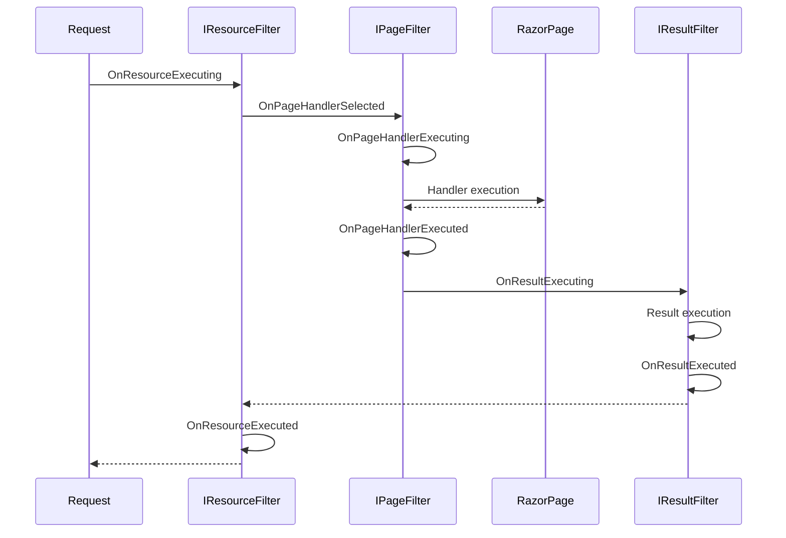
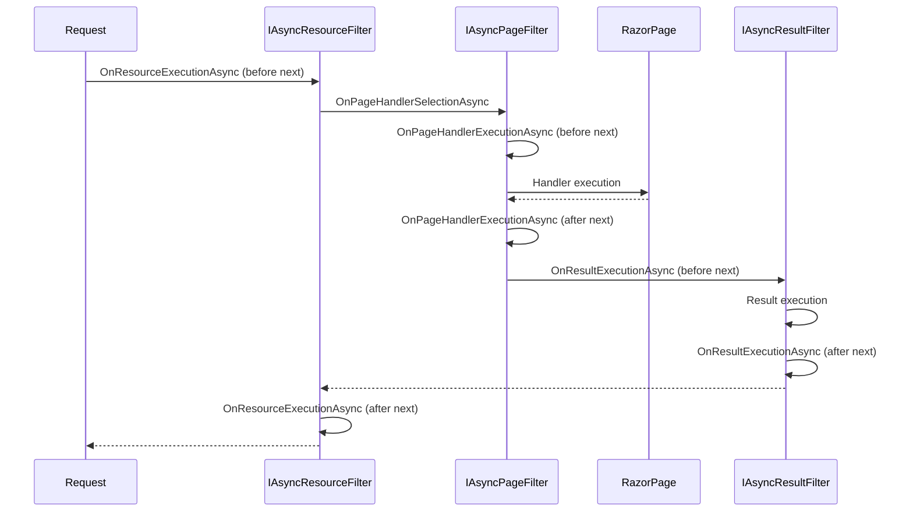

# Filter methods for Razor Pages in ASP.NET Core

## Table of Contents <!-- omit in toc -->

- [Razor Page filters](#razor-page-filters)
- [Filter pipeline execution order](#filter-pipeline-execution-order)
  - [Filter types](#filter-types)
- [Tips for filtering page handler methods](#tips-for-filtering-page-handler-methods)
  - [`IPageFilter`](#ipagefilter)
  - [`IResourceFilter`](#iresourcefilter)
- [References](#references)

## Razor Page filters

Razor Page filters can execute code before and after the execution of a Razor Page handler, but they cannot be applied to individual page handler methods.

## Filter pipeline execution order

**Sync Filters**:



**Async Filters**:



### Filter types

- [`IPageFilter`](https://learn.microsoft.com/ja-jp/dotnet/api/microsoft.aspnetcore.mvc.filters.ipagefilter)
- [`IAsyncPageFilter`](https://learn.microsoft.com/ja-jp/dotnet/api/microsoft.aspnetcore.mvc.filters.iasyncpagefilter)

It has the following characteristics:

- Run code after a handler method has been selected, but before model binding occurs.
- Run code before the handler method executes, after model binding is complete.
- Run code after the handler method executes.
- Can be implemented on a page or globally.
- **Cannot be applied to specific page handler methods.**
- Can have constructor dependencies populated by Dependency Injection (DI). For more information, see ServiceFilterAttribute and TypeFilterAttribute.

## Tips for filtering page handler methods

In the case of Razor Pages, it is not possible to set a filter for each action method.

However, since there is information that can be obtained within the filter, it is possible to pass through the filter depending on the specified conditions.If the request is not for an action method, I think you can just let it pass through.

### `IPageFilter`

In the case of `IPageFilter`, you can use `HandlerMethodDescriptor`, which tells you which handler the request is for.

```cs
public async Task OnPageHandlerExecutionAsync(PageHandlerExecutingContext context, PageHandlerExecutionDelegate next)
{
    if (!IsHandled(context.HandlerMethod))
    {
        await next();
    }

    await OnPageHandlerExecutionAsyncCore(context, next);
    return;
}

private bool IsHandled(HandlerMethodDescriptor? handlerMethod)
{
    if (HandlerMethodNames is null)
    {
        return true;
    }

    if (HandlerMethodNames.Any(x => x == handlerMethod?.Name))
    {
        return true;
    }

    return false;
}
```

I wish Linq could be made a little faster...

### `IResourceFilter`

`IResourceFilter` does not have a HandlerMethodDescriptor, but you can use `HttpContext.Request`. I don't think it can be determined with `ActionDescriptor`.

RazorPage's handler method can be retrieved with QueryString.

```cs
_  public void OnResourceExecuting(ResourceExecutingContext context)
{
    if (!IsHandled(context.HttpContext))
    {
        return;
    }

    OnResourceExecutingCore(context);
}

private bool IsHandled(HttpContext httpContext)
{
    if (HandlerMethodNames is null)
    {
        return true;
    }

    var handler = httpContext.Request.Query["handler"];
    if (HandlerMethodNames.Any(x => x == handler))
    {
        return true;
    }

    return false;
}
```

## References

- [Filter methods for Razor Pages in ASP.NET Core](https://learn.microsoft.com/ja-jp/aspnet/core/razor-pages/filter)
