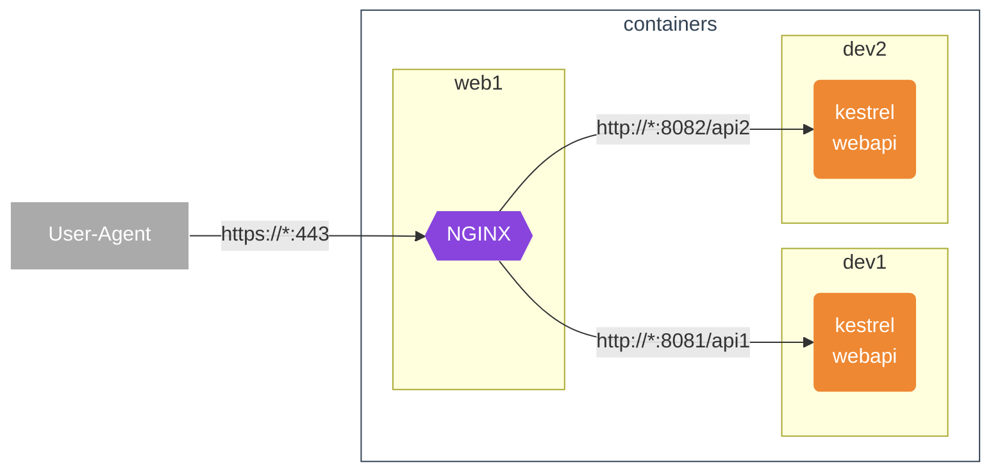

# Urls Path base rewriting

## Table of contents <!-- omit in toc -->

- [Urls Path base rewriting](#urls-path-base-rewriting)
  - [Situation](#situation)
  - [Configuration](#configuration)

## Situation

This is required if you want to add a prefix to the URL.



In such a configuration, it is difficult to set the prefix in advance on the application side, so I would like to build the application with the prefix ignored.

## Configuration

Use [`UsePathBase`](https://learn.microsoft.com/ja-jp/dotnet/api/microsoft.aspnetcore.builder.usepathbaseextensions.usepathbase?view=aspnetcore-8.0) to achieve this.

The order in which you set this method is important.

Basically before `UseRouting`. Add as needed.

```cs
app.UsePathBase("/api1"); // here
app.UseRouting();
```

However, if you have swagger while debugging, PathBase will only be valid for swagger if you don't put it before `UseSwagger`.

```cs
app.UsePathBase("/api1"); // here

// Configure the HTTP request pipeline.
if (app.Environment.IsDevelopment())
{
    app.UseSwagger();
    app.UseSwaggerUI();
}

app.UseRouting();
```

If you use a reverse proxy, you may need to disable UseHttpsRedirection.

```cs
//app.UseHttpsRedirection();
```
