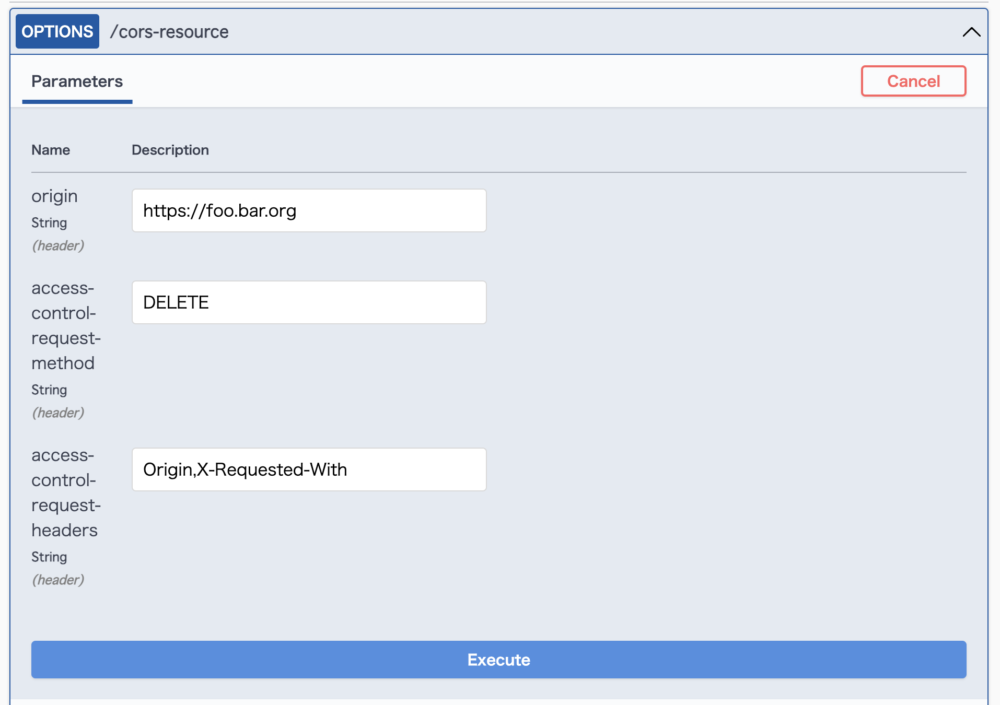
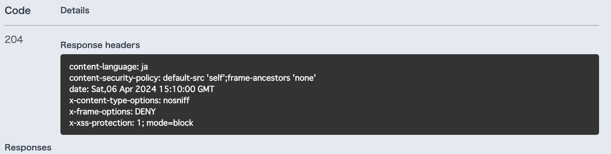
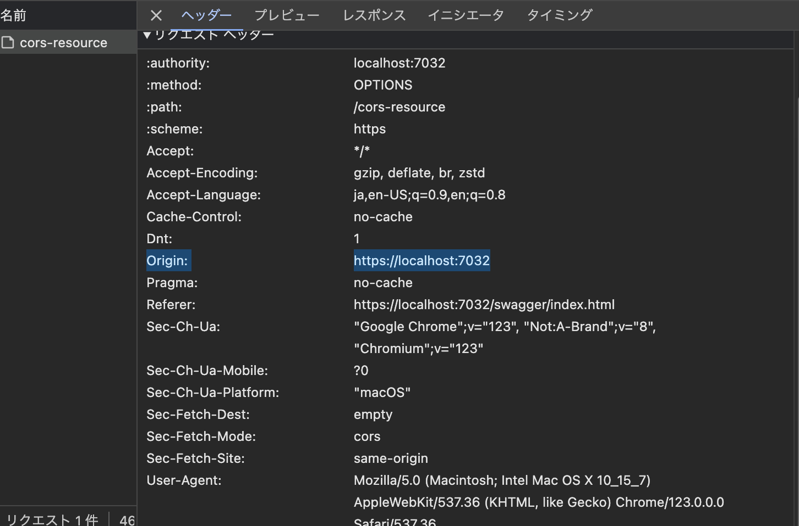

# CORS (Cross-Origin Resource Sharing)

Cross-Origin Resource Sharing (CORS) is an HTTP-header based mechanism that allows a server to indicate any origins (domain, scheme, or port) other than its own from which a browser should permit loading resources.

## Table of contents <!-- omit in toc -->

- [CORS (Cross-Origin Resource Sharing)](#cors-cross-origin-resource-sharing)
  - [References](#references)
  - [Overview](#overview)
    - [Preflight request](#preflight-request)
  - [Configuration CORS in ASP.NET Core](#configuration-cors-in-aspnet-core)
    - [Enable CORS](#enable-cors)
    - [CORS with named policy and middleware](#cors-with-named-policy-and-middleware)
    - [Enable Cors with endpoint routing](#enable-cors-with-endpoint-routing)
    - [Enable CORS with attributes](#enable-cors-with-attributes)
    - [Enable Preflight request ?](#enable-preflight-request-)
  - [AddPolicy() code corresponding to the HTTP header used in CORS](#addpolicy-code-corresponding-to-the-http-header-used-in-cors)
    - [Access-Control-Allow-Origin:](#access-control-allow-origin)
    - [Access-Control-Allow-Credentials:](#access-control-allow-credentials)
    - [Access-Control-Allow-Headers:](#access-control-allow-headers)
    - [Access-Control-Allow-Methods：](#access-control-allow-methods)
    - [Access-Control-Expose-Headers：](#access-control-expose-headers)
    - [Access-Control-Max-Age:](#access-control-max-age)
  - [How to test CORS](#how-to-test-cors)
    - [CORS Test tool web site.](#cors-test-tool-web-site)
    - [Postman](#postman)
    - [cURL command](#curl-command)


## References

- [Cross-Origin Resource Sharing (CORS) - HTTP | MDN](https://developer.mozilla.org/ja/docs/Web/HTTP/CORS)
- [Enable Cross-Origin Requests (CORS) in ASP.NET Core | Microsoft Learn](https://docs.microsoft.com/ja-jp/aspnet/core/security/cors)


## Overview

For security reasons, browsers restrict cross-origin HTTP requests initiated from scripts. For example, `fetch()` and `XMLHttpRequest` follow the same-origin policy. 


### Preflight request

A CORS preflight request is a CORS request that checks to see if the CORS protocol is understood and a server is aware using specific methods and headers.

It is an OPTIONS request, using two or three HTTP request headers: `Access-Control-Request-Method`, Origin, and optionally `Access-Control-Request-Headers`.

A preflight request is automatically issued by a browser and in normal cases, front-end developers don't need to craft such requests themselves. 

```shell
curl -X "OPTIONS" -v --insecure \
  -H "Access-Control-Request-Method: DELETE" \
  -H "Access-Control-Request-Headers: Origin, X-Requested-With" \
  -H "Origin: https://foo.bar.org" \
  https://localhost:7032/cors-resource
```

If CORS is not enabled:

```console
> OPTIONS /cors-resource HTTP/2
> Host: localhost:7032
> user-agent: curl/7.88.1
> accept: */*
> access-control-request-method: DELETE
> access-control-request-headers: Origin, X-Requested-With
> origin: https://foo.bar.org
> 

< HTTP/2 204 
< date: Sat, 06 Apr 2024 07:51:27 GMT
< 
```

If CORS is enabled:

```console
> OPTIONS /cors-resource HTTP/2
> Host: localhost:7032
> user-agent: curl/7.88.1
> accept: */*
> access-control-request-method: DELETE
> access-control-request-headers: Origin, X-Requested-With
> origin: https://foo.bar.org
> 

< HTTP/2 204 
< date: Sat, 06 Apr 2024 07:52:34 GMT
< access-control-allow-headers: Origin,X-Requested-With
< access-control-allow-methods: DELETE
< access-control-allow-origin: https://foo.bar.org
< vary: Origin
< 
```

The browser can skip the preflight request if all the following conditions are true:

- The request method is `GET`, `HEAD`, or `POST`.
- The app doesn't set request headers other than `Accept`, `Accept-Language`, `Content-Language`, `Content-Type`, or `Last-Event-ID`.
- The `Content-Type` header, if set, has one of the following values:
  - `application/x-www-form-urlencoded`
  - `multipart/form-data`
  - `text/plain`


<!-- --------------------------- -->

## Configuration CORS in ASP.NET Core


### Enable CORS

There are three ways to enable CORS:

- In middleware using a named policy or default policy.
- Using endpoint routing.
- With the [EnableCors] attribute.


### CORS with named policy and middleware

The following code applies a CORS policy to all the app's endpoints with the specified origins:

```cs
var  MyAllowSpecificOrigins = "_myAllowSpecificOrigins";

var builder = WebApplication.CreateBuilder(args);

builder.Services.AddCors(options =>
{
    options.AddPolicy(name: MyAllowSpecificOrigins,
                      policy  =>
                      {
                          policy.WithOrigins("http://example.com",
                                              "http://www.contoso.com");
                      });
});

builder.Services.AddControllers();

var app = builder.Build();
app.UseHttpsRedirection();
app.UseStaticFiles();
app.UseRouting();

app.UseCors(MyAllowSpecificOrigins);

app.UseAuthorization();

app.MapControllers();

app.Run();
```

### Enable Cors with endpoint routing

With endpoint routing, CORS can be enabled on a per-endpoint basis using the `RequireCors` set of extension methods:

```cs
var MyAllowSpecificOrigins = "_myAllowSpecificOrigins";

var builder = WebApplication.CreateBuilder(args);

builder.Services.AddCors(options =>
{
    options.AddPolicy(name: MyAllowSpecificOrigins,
                      policy =>
                      {
                          policy.WithOrigins("http://example.com",
                                              "http://www.contoso.com");
                      });
});

builder.Services.AddControllers();
builder.Services.AddRazorPages();

var app = builder.Build();

app.UseHttpsRedirection();
app.UseStaticFiles();
app.UseRouting();

app.UseCors();

app.UseAuthorization();

app.UseEndpoints(endpoints =>
{
    endpoints.MapGet("/echo",
        context => context.Response.WriteAsync("echo"))
        .RequireCors(MyAllowSpecificOrigins);

    endpoints.MapControllers()
             .RequireCors(MyAllowSpecificOrigins);

    endpoints.MapGet("/echo2",
        context => context.Response.WriteAsync("echo2"));

    endpoints.MapRazorPages();
});

app.Run();

```

### Enable CORS with attributes

Enabling CORS with the [EnableCors] attribute and applying a named policy to only those endpoints that require CORS provides the finest control.

```cs
[Route("api/[controller]")]
[ApiController]
public class WidgetController : ControllerBase
{
    // GET api/values
    [EnableCors("AnotherPolicy")]
    [HttpGet]
    public ActionResult<IEnumerable<string>> Get()
    {
        return new string[] { "green widget", "red widget" };
    }

    // GET api/values/5
    [EnableCors("Policy1")]
    [HttpGet("{id}")]
    public ActionResult<string> Get(int id)
    {
        return id switch
        {
            1 => "green widget",
            2 => "red widget",
            _ => NotFound(),
        };
    }
}
```

### Enable Preflight request ?

Is it possible to check CORS by sending origin from Swagger UI?

```cs
public class RequestHeaderParameterOperationFilter : IOperationFilter
{
    public void Apply(OpenApiOperation operation, OperationFilterContext context)
    {
        var appendices = context.MethodInfo
            .GetCustomAttributes(inherit: true)
            .OfType<RequestHeaderParameterAttribute>()
            .Where(x => !operation.Parameters.Any(y => y.Name == x.Name))
            ;

        foreach (var attr in appendices)
        {
            operation.Parameters.Add(
                new()
                {
                    Name = attr.Name,
                    In = ParameterLocation.Header,
                    Description = attr.Description,
                    Required = false,
                    Schema = new OpenApiSchema
                    {
                        Type = "String",
                        Default = new OpenApiString(attr.Default)
                    }
                });
        }

        return;
    }
}
```

Add Swagger parameter in Attributes:

```cs
    [RequestHeaderParameter("origin", defaultValue: "https://foo.bar.org")]
    [RequestHeaderParameter("access-control-request-method", defaultValue: "DELETE")]
    [RequestHeaderParameter("access-control-request-headers", defaultValue: "Origin,X-Requested-With")]
    [HttpOptions]
    public IActionResult PreflightRequestAsync()
    {
        _logger.LogTrace("called.");

        //await Task.Delay(0, cancellationToken);
        return NoContent();
    }
```

Try sending from this screen:





Oh?



Is it impossible to rewrite security headers?


<!-- --------------------------- -->

## AddPolicy() code corresponding to the HTTP header used in CORS

### Access-Control-Allow-Origin:

The `Access-Control-Allow-Origin` response header indicates whether the response can be shared with requesting code from the given origin.

```cs
policy.WithOrigins("http://localhost:8889");
```

```console
< access-control-allow-origin: http://localhost:8889
```

### Access-Control-Allow-Credentials:

The `Access-Control-Allow-Credentials` response header tells browsers whether the server allows cross-origin HTTP requests to include credentials.

Credentials are cookies, TLS client certificates, or authentication headers containing a username and password. By default, these credentials are not sent in cross-origin requests, and doing so can make a site vulnerable to CSRF attacks.

```cs
policy.WithOrigins("http://localhost:8889")
    .AllowCredentials();
```

```console
< access-control-allow-origin: http://localhost:8889
< access-control-allow-credentials: true
```

### Access-Control-Allow-Headers:

The `Access-Control-Allow-Headers` response header is used in response to a preflight request which includes the `Access-Control-Request-Headers` to indicate which HTTP headers can be used during the actual request.

> [CORS-safelisted request headers](https://developer.mozilla.org/en-US/docs/Glossary/CORS-safelisted_request_header) are always allowed and usually aren't listed in Access-Control-Allow-Headers (unless there is a need to circumvent the safelist additional restrictions).
> - `Accept`
> - `Accept-Language`
> - `Content-Language`
> - `Content-Type`
> - `Range`

```cs
policy.WithOrigins("http://localhost:8889")
    //.AllowAnyHeader()
    .WithHeaders(HeaderNames.ContentType, "x-custom-header");
```

```console
< access-control-allow-origin: http://localhost:8889
< access-control-allow-headers: x-custom-header
```

### Access-Control-Allow-Methods：

The `Access-Control-Allow-Methods` response header specifies one or more methods allowed when accessing a resource in response to a preflight request.

```cs
policy.WithOrigins("http://localhost:8889")
    //.AllowAnyMethod()
    .WithMethod("PATCH");
```

```console
< access-control-allow-origin: http://localhost:8889
< access-control-allow-methods: PATCH
```

### Access-Control-Expose-Headers：

The `Access-Control-Expose-Headers` response header allows a server to indicate which response headers should be made available to scripts running in the browser, in response to a cross-origin request.

> Only the [CORS-safelisted response headers](https://developer.mozilla.org/en-US/docs/Glossary/CORS-safelisted_response_header) are exposed by default. For clients to be able to access other headers, the server must list them using the Access-Control-Expose-Headers header.
> - `Cache-Control`
> - `Content-Language`
> - `Content-Length`
> - `Content-Type`
> - `Expires`
> - `Last-Modified`
> - `Pragma`

```cs
policy.WithOrigins("http://localhost:8889")
    .WithExposedHeaders("Content-Encoding");
```

```console
< access-control-allow-origin: http://localhost:8889
< access-control-expose-headers: Content-Encoding
```

### Access-Control-Max-Age:

The `Access-Control-Max-Age` response header indicates how long the results of a preflight request (that is the information contained in the `Access-Control-Allow-Methods` and `Access-Control-Allow-Headers` headers) can be cached.

The default value seems to be 5 seconds. No new preflight requests appear to be sent while this value is in effect.

```cs
policy.WithOrigins("http://localhost:8889")
    .SetPreflightMaxAge(TimeSpan.FromSeconds(2520));
```

```console
< access-control-allow-origin: http://localhost:8889
< access-control-max-age: 2520
```


<!-- --------------------------- -->

## How to test CORS

### CORS Test tool web site.

- [CORS Tester](https://cors-test.codehappy.dev/)

### Postman

You can check by submitting a Preflight request:

- Method: OPTIONS
- Origin: localhost:3000
- Access-Control-Request-Method: GET
- Access-Control-Request-Method: x-requested-with


### cURL command

``` shell
curl -X "OPTIONS" -v --insecure \
  -H "Access-Control-Request-Method: DELETE" \
  -H "Access-Control-Request-Headers: Origin, X-Requested-With" \
  -H "Origin: https://foo.bar.org" \
  https://localhost:7032/cors-resource
```

If CORS is not enabled:

```console
> OPTIONS /cors-resource HTTP/2
> Host: localhost:7032
> user-agent: curl/7.88.1
> accept: */*
> access-control-request-method: DELETE
> access-control-request-headers: Origin, X-Requested-With
> origin: https://foo.bar.org
> 

< HTTP/2 204 
< date: Sat, 06 Apr 2024 07:51:27 GMT
< 
```

If CORS is enabled:

```console
> OPTIONS /cors-resource HTTP/2
> Host: localhost:7032
> user-agent: curl/7.88.1
> accept: */*
> access-control-request-method: DELETE
> access-control-request-headers: Origin, X-Requested-With
> origin: https://foo.bar.org
> 

< HTTP/2 204 
< date: Sat, 06 Apr 2024 07:52:34 GMT
< access-control-allow-headers: Origin,X-Requested-With
< access-control-allow-methods: DELETE
< access-control-allow-origin: https://foo.bar.org
< vary: Origin
< 
```
