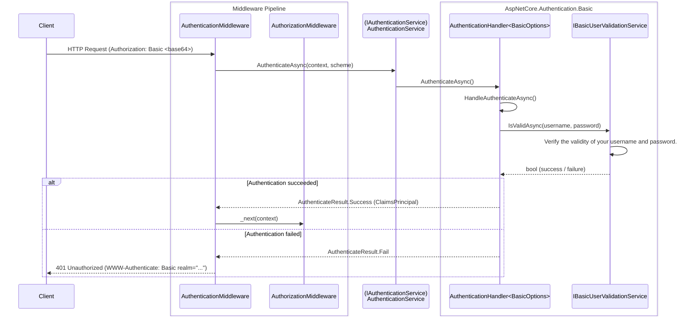

# Examples.Web.Authentication.Basic

## Table of Contents <!-- omit in toc -->

- [AspNetCore.Authentication.Basic](#aspnetcoreauthenticationbasic)
  - [Setup this project](#setup-this-project)
    - [1. Register services (Program.cs)](#1-register-services-programcs)
    - [2. Middleware pipeline (Program.cs)](#2-middleware-pipeline-programcs)
    - [3. Configure appsettings.json](#3-configure-appsettingsjson)
  - [Authentication flow](#authentication-flow)
- [Development](#development)
  - [How the project was initialized](#how-the-project-was-initialized)
- [References](#references)

## AspNetCore.Authentication.Basic

Easy to use and very light weight Microsoft style Basic Scheme Authentication Implementation for ASP.NET Core.

- [AspNetCore.Authentication.Basic ...](https://github.com/mihirdilip/aspnetcore-authentication-basic)

### Setup this project

#### 1. Register services (Program.cs)

Add the following to `Program.cs`:

```cs
//# Add Basic Authentication.
builder.Services.AddAuthentication(defaultScheme: BasicAuthentication.DefaultScheme)
  .AddCustomBasic(option => builder.Configuration.GetSection("Authentication").Bind(option));
```

`AddCustomBasic` is a custom extension method defined in this project (`AuthenticationBuilderExtensions`).
It registers the following services internally:

- `IUserRepository` → `InMemoryUserRepository` (Singleton) — repository for user data
- `IBasicUserValidationService` → `BasicUserValidationService` — validation service required by the library

> [!WARNING]
> `InMemoryUserRepository` and `BasicUserValidationService` are for demo purposes only.
> **Do not use them in production.** Replace with your own `IUserRepository` implementation.

#### 2. Middleware pipeline (Program.cs)

The authentication and authorization middleware must be placed after routing:

```cs
app.UseRouting();

app.UseAuthentication();   // Authentication middleware (required)
app.UseAuthorization();    // Authorization middleware
```

#### 3. Configure appsettings.json

Set the `BasicAuthenticationOption` values in `appsettings.json`:

```json
{
  "Authentication": {
    "Realm": "examples.local"
  }
}
```

| Property | Description | Default |
| --- | --- | --- |
| `Realm` | Protection space identifier included in the `WWW-Authenticate` header | `"Access to sites that require authentication"` |

### Authentication flow



## Development

### How the project was initialized

This project was initialized with the following command:

```shell
## Solution
dotnet new sln -o .

## Examples.Web.Authentication.Basic
dotnet new webapp -o src/Examples.Web.Authentication.Basic
dotnet sln add src/Examples.Web.Authentication.Basic/
cd src/Examples.Web.Authentication.Basic
dotnet add reference ../Examples.Web.Infrastructure/
dotnet add package AspNetCore.Authentication.Basic

dotnet user-secrets init
cd ../../

# Update outdated package
dotnet list package --outdated
```

## References

- [RFC 7235 - HTTP Authentication](https://datatracker.ietf.org/doc/html/rfc7235)
- [RFC 7617 - The 'Basic' HTTP Authentication Scheme](https://tex2e.github.io/rfc-translater/html/rfc7617.html)
- [AspNetCore.Authentication.Basic (GitHub)](https://github.com/mihirdilip/aspnetcore-authentication-basic)
