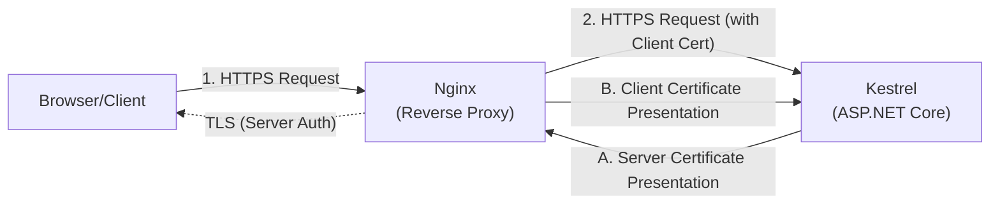
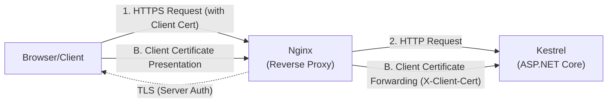

# Examples.Web.Authentication.Certificate

## Table of Contents <!-- omit in toc -->

- [Microsoft.AspNetCore.Authentication.Certificate](#microsoftaspnetcoreauthenticationcertificate)
  - [Set up this project](#set-up-this-project)
    - [1. Set up authentication (Program.cs)](#1-set-up-authentication-programcs)
    - [2. Set up middleware pipeline (Program.cs)](#2-set-up-middleware-pipeline-programcs)
    - [3. Set up authorization](#3-set-up-authorization)
    - [4. Set up Kestrel TLS handshake](#4-set-up-kestrel-tls-handshake)
- [Scenarios](#scenarios)
  - [1. When importing a CA certificate into the OS](#1-when-importing-a-ca-certificate-into-the-os)
  - [2. When managing CA certificates in a custom store](#2-when-managing-ca-certificates-in-a-custom-store)
    - [2.1. Configure Authentication](#21-configure-authentication)
    - [2.2. Configure custom store path](#22-configure-custom-store-path)
    - [2.3. Configure Kestrel custom trust store](#23-configure-kestrel-custom-trust-store)
    - [3.1. Create a certificate for mTLS using the shell](#31-create-a-certificate-for-mtls-using-the-shell)
    - [3.2. Kestrel mTLS setup](#32-kestrel-mtls-setup)
    - [3.3. Nginx mTLS proxy setup](#33-nginx-mtls-proxy-setup)
  - [4. When obtaining a client certificate authenticated by a proxy](#4-when-obtaining-a-client-certificate-authenticated-by-a-proxy)
    - [4.1. Create a certificate for client authentication via proxy](#41-create-a-certificate-for-client-authentication-via-proxy)
    - [4.2. Certificate forwarding (ASP.NET Core)](#42-certificate-forwarding-aspnet-core)
    - [4.3. Certificate forwarding (Nginx)](#43-certificate-forwarding-nginx)
- [Development](#development)
  - [Build](#build)
  - [Run](#run)
  - [How the project was initialized](#how-the-project-was-initialized)
- [References](#references)

## Microsoft.AspNetCore.Authentication.Certificate

Provides classes to support certificate authentication.

When hosting with Kestrel, a certificate is requested during the handshake, so the certificate selection screen will be displayed almost constantly throughout the site.

To restrict access to only authenticated users on a page-by-page basis, use app-level authentication.

### Set up this project

#### 1. Set up authentication (Program.cs)

Add the following to `Program.cs`:

```cs
var customTrustStorePath = builder.Configuration["Authentication:Certificate:CustomTrustStore"];
var customTrustStore = string.IsNullOrEmpty(customTrustStorePath) ? null
    : CertificateLoader.LoadCertificates(customTrustStorePath);

builder.Services.AddAuthentication(
        CertificateAuthenticationDefaults.AuthenticationScheme)
    .AddCertificate(options =>
    {
        options.RevocationMode = X509RevocationMode.NoCheck;

        if (customTrustStore is not null)
        {
            options.ChainTrustValidationMode = X509ChainTrustMode.CustomRootTrust;
            options.CustomTrustStore.AddRange(customTrustStore);
        }
    });
```

#### 2. Set up middleware pipeline (Program.cs)

```cs
app.UseCertificateForwarding();

app.UseHttpsRedirection();
app.UseRouting();
app.UseAuthentication();
app.UseAuthorization();
```

#### 3. Set up authorization

Page-level authentication is done using AuthorizeAttribute, just like other authentication methods.

In this sample, a fallback policy is applied so all pages require authenticated users by default.

```cs
builder.Services.AddAuthorizationBuilder()
    .SetFallbackPolicy(new AuthorizationPolicyBuilder()
    .RequireAuthenticatedUser()
    .Build());
```

#### 4. Set up Kestrel TLS handshake

Set up `ClientCertificateMode` to require a client certificate during the TLS handshake.

Edit `Program.cs`:

```cs
builder.Services.Configure<Microsoft.AspNetCore.Server.Kestrel.Core.KestrelServerOptions>(options =>
{
    options.ConfigureHttpsDefaults(httpsOptions =>
    {
        httpsOptions.ClientCertificateMode =
            Microsoft.AspNetCore.Server.Kestrel.Https.ClientCertificateMode.RequireCertificate;
    });
});
```

You can also set up `ClientCertificateMode` in `appsettings.json`:

```json
{
  "Kestrel": {
      "Endpoints": {
          "Https": {
              "Url": "https://+:7021",
              "ClientCertificateMode": "RequireCertificate"
          }
      }
  }
}
```

For advanced TLS settings with custom trust store, see scenario 2.3.

## Scenarios

### 1. When importing a CA certificate into the OS

The default certificate authentication handler is configured to refer to the OS's trusted certificate store, so it works simply by registering the CA certificate that generated the client certificate you want to verify with the OS.

Register all intermediate certificates if necessary.

```shell
sudo cp ./assets/example.ca.crt /usr/local/share/ca-certificates/
sudo update-ca-certificates
```

If you create your own certificate, it will be rejected unless you do not perform a revocation check.

```cs
builder.Services.AddAuthentication(
        CertificateAuthenticationDefaults.AuthenticationScheme)
    .AddCertificate(options => options.RevocationMode = X509RevocationMode.NoCheck);
```

### 2. When managing CA certificates in a custom store

Using a custom trust store turned out to be much more difficult than I expected.

The official documentation suggested it could be done with `ChainTrustValidationMode` and `CustomTrustStore`, but it was rejected before authentication even began.

Furthermore, enabling revocation checks (CRL, OCSP) resulted in failure.

#### 2.1. Configure Authentication

Configure the options within `AddCertificate`:

```cs
var certCollection = CertificateLoader.LoadCertificates(
    builder.Configuration["Authentication:Certificate:CustomTrustStore"]);

builder.Services.AddAuthentication(
        CertificateAuthenticationDefaults.AuthenticationScheme)
    .AddCertificate(options =>
    {
        options.ChainTrustValidationMode = X509ChainTrustMode.CustomRootTrust;
        options.CustomTrustStore.AddRange(certCollection);
        options.RevocationMode = X509RevocationMode.NoCheck;
    });
```

#### 2.2. Configure custom store path

This is specified in appsettings.json:

```json
{
  "Authentication": {
    "Certificate": {
      "CustomTrustStore": "../../assets/"
    }
  }
}
```

#### 2.3. Configure Kestrel custom trust store

Configure `OnAuthenticate` in `Program.cs` to apply a custom certificate chain policy with the custom trust store for the TLS handshake.

Use the `certCollection` loaded from the configuration path (see section 2.1):
builder.Services.Configure<Microsoft.AspNetCore.Server.Kestrel.Core.KestrelServerOptions>(options =>
{
    options.ConfigureHttpsDefaults(httpsOptions =>
    {
        httpsOptions.OnAuthenticate = (context, sslOptions) =>
        {
            sslOptions.CertificateChainPolicy = new X509ChainPolicy
            {
                TrustMode = X509ChainTrustMode.CustomRootTrust,
                RevocationMode = X509RevocationMode.NoCheck
            };

            sslOptions.CertificateChainPolicy.CustomTrustStore.AddRange(certCollection);
        };
    });
});

```

`ClientCertificateMode` can be configured in section 4 (`Program.cs` or `appsettings.json`).

### 3. When using mTLS to secure communication between containers

Configuring a secure web proxy behind the scenes means that even internal communications must verify each other's authenticity every time. In other words, it's a "zero trust" configuration.

In this scenario, both Nginx and Kestrel exchange certificates during the TLS handshake (mutual mTLS).



#### 3.1. Create a certificate for mTLS using the shell

For simplicity, we will assume that the server certificate verified by the client and the client certificate verified by the server were issued by the same CA.

```text
─ internal-ca (CA)
  ├─ issue ─> internal-web[nginx] (clientAuth)
  └─ issue ─> internal-dev[kestrel] (serverAuth)
```

```shell
./.devcontainer/ssl/mtls/mtls-cert-generate.sh
```

It is mounted to `/etc/ssl/local` inside the container.

#### 3.2. Kestrel mTLS setup

Change the ASP.NET server certificate and start the application.

Since certificate authentication is already configured, clarifying who verifies what will only require configuring the certificate itself.

#### 3.3. Nginx mTLS proxy setup

See the following nginx configuration:

- [003-backend-mtls-proxy.conf](../../.devcontainer/web/nginx.conf.d/locations.d/003-backend-mtls-proxy.conf)

### 4. When obtaining a client certificate authenticated by a proxy

Client certificates authenticated by the proxy can be obtained using the proxy's custom header.

In this scenario, the client presents the certificate to Nginx, and Nginx forwards it to Kestrel via a custom header (X-Client-Cert). Kestrel does not perform the TLS handshake with the client, but receives and validates the forwarded certificate.



For certificate forwarding alone, either HTTP or HTTPS can be used between Proxy and Kestrel.

#### 4.1. Create a certificate for client authentication via proxy

The certificates we receive from customers are issued by a different Certificate Authority (CA) than server certificates or certificates used internally.

```text
- external-ca (CA)
  └─ issue ─> external-client (clientAuth)
```

#### 4.2. Certificate forwarding (ASP.NET Core)

Configure client certificate restoration from the forwarded header in `Program.cs`:

```cs
builder.Services.AddCertificateForwarding(options =>
{
    options.CertificateHeader = "X-Client-Cert";

    options.HeaderConverter = (headerValue) =>
    {
        if (string.IsNullOrWhiteSpace(headerValue))
        {
            return null!;
        }

        var clientCertificate = X509Certificate2.CreateFromPem(
            System.Net.WebUtility.UrlDecode(headerValue));

        if (clientCertificate is null)
        {
            return null!;
        }

        return clientCertificate;
    };
});
```

Middleware must run before UseAuthentication:

```cs
//# Enable Certificate Forwarding Middleware to forward the client certificate from Nginx to ASP.NET Core.
app.UseCertificateForwarding();

app.UseAuthentication();
app.UseAuthorization();
```

#### 4.3. Certificate forwarding (Nginx)

See the following nginx configuration:

- [server-001-client-cert-auth.conf](../../.devcontainer/web/nginx.conf.d/server-001-client-cert-auth.conf)

## Development

### Build

Build this project from the repository root:

```shell
dotnet build src/Examples.Web.Authentication.Certificate/
```

### Run

Run this project from the repository root:

```shell
dotnet run --project src/Examples.Web.Authentication.Certificate/ -lp https
```

### How the project was initialized

This project was initialized with the following commands:

```shell
## Solution
dotnet new sln -o .

## Examples.Web.Authentication.Certificate
dotnet new webapp -o src/Examples.Web.Authentication.Certificate
dotnet sln add src/Examples.Web.Authentication.Certificate/
cd src/Examples.Web.Authentication.Certificate
dotnet add reference ../Examples.Web.Infrastructure/
dotnet add reference ../Examples.Web.Infrastructure.Assets/
dotnet add package Microsoft.AspNetCore.Authentication.Certificate

dotnet user-secrets init
cd ../../

# Check outdated packages
dotnet list package --outdated
```

## References

- [Configure certificate authentication in ASP.NET Core | Microsoft Learn](https://learn.microsoft.com/ja-jp/aspnet/core/security/authentication/certauth)
- [Configure client certificates in appsettings.json](https://learn.microsoft.com/ja-jp/aspnet/core/fundamentals/servers/kestrel/endpoints#configure-client-certificates-in-appsettingsjson)
