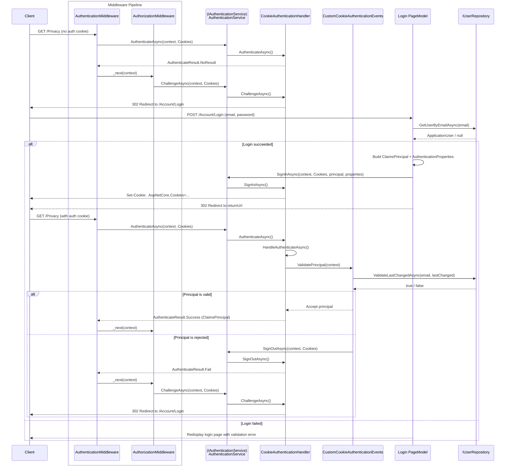

# Examples.Web.Authentication.Cookie

## Table of Contents <!-- omit in toc -->

- [Microsoft.AspNetCore.Authentication.Cookies](#microsoftaspnetcoreauthenticationcookies)
  - [Cookie Policy Middleware](#cookie-policy-middleware)
  - [Setup this project](#setup-this-project)
    - [1. Set up authentication (Program.cs)](#1-set-up-authentication-programcs)
    - [2. Setup middleware pipeline (Program.cs)](#2-setup-middleware-pipeline-programcs)
    - [3. Configure appsettings.json](#3-configure-appsettingsjson)
      - [Expiration settings](#expiration-settings)
  - [Authentication flow](#authentication-flow)
- [Development](#development)
  - [How the project was initialized](#how-the-project-was-initialized)
- [References](#references)

## Microsoft.AspNetCore.Authentication.Cookies

Contains types that support cookie based authentication.

### Cookie Policy Middleware

`app.UseCookiePolicy(...)` is the Cookie Policy Middleware.
It applies a global policy before cookies are appended/deleted by app code and frameworks.

In this project, the policy is:

- `MinimumSameSitePolicy = SameSiteMode.Strict`

This means all cookies are forced to at least `SameSite=Strict`.

> [!WARNING]
> `SameSiteMode.Strict` blocks cross-site cookie sends.
> External sign-in flows such as OAuth2/OpenID Connect generally require `Lax` or `None`.

### Setup this project

#### 1. Set up authentication (Program.cs)

Add the following to `Program.cs`:

```cs
builder.Services.AddControllersWithViews();

//# Add Cookie Authentication.
builder.Services.AddAuthentication(CookieDefaults.AuthenticationScheme)
  .AddCustomCookie(options => builder.Configuration.GetSection("Authentication").Bind(options));
```

`AddCustomCookie` is a custom extension method defined in this project (`AuthenticationBuilderExtensions`).
It registers the following services internally:

- `CustomCookieAuthenticationEvents` (Scoped) - custom cookie event handlers
- `IUserRepository` -> `InMemoryUserRepository` (Singleton) - demo user store
- `IHttpContextAccessor` - helper for accessing `HttpContext` in services and views

> [!WARNING]
> `InMemoryUserRepository` is for demo purposes only.
> **Do not use it in production.** Replace with your own implementation.

#### 2. Setup middleware pipeline (Program.cs)

The authentication and authorization middleware must be placed after routing:

```cs
app.UseRouting();

app.UseCookiePolicy(new CookiePolicyOptions
{
  MinimumSameSitePolicy = SameSiteMode.Strict,
});

app.UseAuthentication();
app.UseAuthorization();

app.MapDefaultControllerRoute();
```

#### 3. Configure appsettings.json

You can override cookie authentication options in `appsettings.json` via the `Authentication` section:

```json
{
 "Authentication": {
  "ExpireTimeSpan": "00:20:00",
  "SlidingExpiration": true,
  "LoginPath": "/Account/Login/",
  "AccessDeniedPath": "/Forbidden/"
 }
}
```

If this section is omitted, the defaults configured in `AddCustomCookie` are used.

##### Expiration settings

Cookie expiration behavior is controlled by both `CookieAuthenticationOptions` and `AuthenticationProperties` at sign-in time.

- Default option (`AddCustomCookie`): `ExpireTimeSpan = 00:20:00`
- Runtime override (`Login.cshtml.cs`): `AuthenticationProperties.ExpiresUtc = UtcNow + 10 minutes`
- Sliding renewal: `SlidingExpiration = true`

Priority and behavior:

- `ExpiresUtc` is set during `SignInAsync`, so it overrides `ExpireTimeSpan` for that sign-in ticket.
- With `SlidingExpiration = true`, active sessions can be re-issued before expiration.
- `IsPersistent` determines whether the cookie becomes persistent (survives browser restart) or session-only.

### Authentication flow



## Development

### How the project was initialized

This project was initialized with the following commands:

```shell
## Solution
dotnet new sln -o .

## Examples.Web.Authentication.Cookie
dotnet new webapp -o src/Examples.Web.Authentication.Cookie
dotnet sln add src/Examples.Web.Authentication.Cookie/
cd src/Examples.Web.Authentication.Cookie
dotnet add reference ../Examples.Web.Infrastructure/

dotnet user-secrets init
cd ../../

# Check outdated packages
dotnet list package --outdated
```

## References

- [Use cookie authentication without ASP.NET Core Identity | Microsoft Learn](https://learn.microsoft.com/ja-jp/aspnet/core/security/authentication/cookie)
