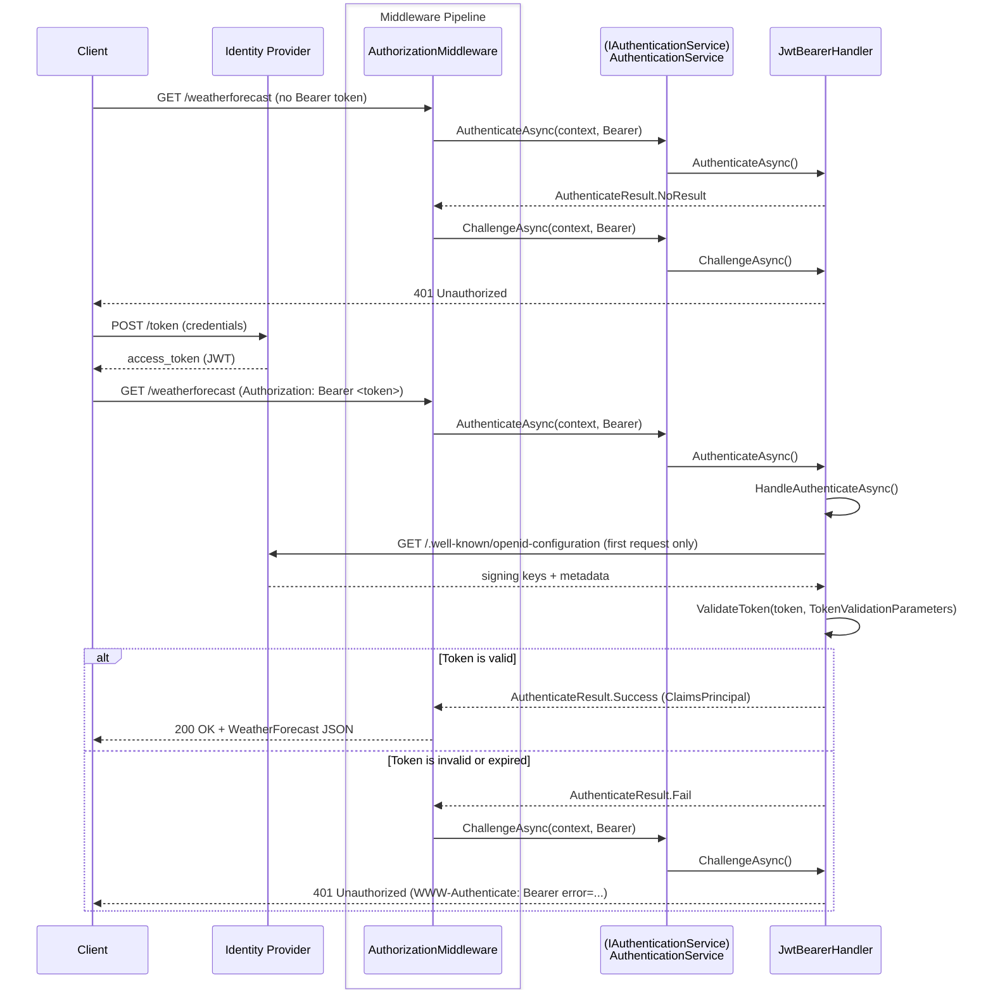

# Examples.Web.Authentication.JwtBearer

## Table of Contents <!-- omit in toc -->

- [Microsoft.AspNetCore.Authentication.JwtBearer](#microsoftaspnetcoreauthenticationjwtbearer)
  - [Set up this project](#set-up-this-project)
    - [1. Set up authentication (Program.cs)](#1-set-up-authentication-programcs)
    - [2. Set up authorization (Program.cs)](#2-set-up-authorization-programcs)
    - [3. Set up middleware pipeline (Program.cs)](#3-set-up-middleware-pipeline-programcs)
    - [4. Configure appsettings.json](#4-configure-appsettingsjson)
  - [Authentication flows](#authentication-flows)
- [Scenarios](#scenarios)
  - [1. Local testing with `dotnet user-jwts`](#1-local-testing-with-dotnet-user-jwts)
    - [Update Program.cs](#update-programcs)
    - [Create a token](#create-a-token)
    - [Call the API](#call-the-api)
  - [2. JWT Bearer authentication with Auth0](#2-jwt-bearer-authentication-with-auth0)
    - [Set up Auth0](#set-up-auth0)
    - [Update Program.cs](#update-programcs-1)
    - [Create a token](#create-a-token-1)
    - [Call the API](#call-the-api-1)
- [Development](#development)
  - [Build](#build)
  - [Run](#run)
  - [How the project was initialized](#how-the-project-was-initialized)
- [References](#references)

## Microsoft.AspNetCore.Authentication.JwtBearer

Contains types that support JWT Bearer token authentication.

JWT Bearer authentication validates incoming `Authorization: Bearer <token>` headers.
The token is verified against the identity provider's signing keys and the configured validation parameters.

### Set up this project

#### 1. Set up authentication (Program.cs)

Add the following to `Program.cs`:

```cs
builder.Services.AddAuthentication(JwtBearerDefaults.AuthenticationScheme)
    .AddJwtBearer(jwtOptions =>
    {
        jwtOptions.Authority = "https://{--your-authority--}";
        jwtOptions.Audience = "https://{--your-audience--}";
    })
    .AddJwtBearer("some-scheme", jwtOptions =>
    {
        jwtOptions.MetadataAddress = builder.Configuration["Api:MetadataAddress"]!;
        jwtOptions.Authority = builder.Configuration["Api:Authority"];
        jwtOptions.Audience = builder.Configuration["Api:Audience"];
        jwtOptions.TokenValidationParameters = new TokenValidationParameters
        {
            ValidateIssuer = true,
            ValidateAudience = true,
            ValidateIssuerSigningKey = true,
            ValidAudiences = builder.Configuration.GetSection("Api:ValidAudiences").Get<string[]>(),
            ValidIssuers = builder.Configuration.GetSection("Api:ValidIssuers").Get<string[]>()
        };
        jwtOptions.MapInboundClaims = false;
    });
```

Two JWT Bearer schemes are registered:

| Scheme | Description |
|--------|-------------|
| `Bearer` (default) | Hardcoded `Authority` and `Audience` for a quick demo. |
| `some-scheme` | Reads all settings from configuration. Uses `MetadataAddress` for OIDC discovery and explicit `TokenValidationParameters`. `MapInboundClaims = false` preserves original JWT claim names (e.g. `sub` instead of `ClaimTypes.NameIdentifier`).  |

> [!NOTE]
> `MetadataAddress` points to the OIDC discovery document (`.well-known/openid-configuration`).
> When it is specified, `Authority` is optional but can be used for issuer validation.

#### 2. Set up authorization (Program.cs)

A fallback policy is applied so that all endpoints require authentication by default:

```cs
var requireAuthPolicy = new AuthorizationPolicyBuilder()
    .RequireAuthenticatedUser()
    .Build();

builder.Services.AddAuthorizationBuilder()
    .SetFallbackPolicy(requireAuthPolicy);
```

> [!NOTE]
> Endpoints can opt out with `.AllowAnonymous()`.
> In this project, the OpenAPI and Scalar API Reference endpoints are exempted.

#### 3. Set up middleware pipeline (Program.cs)

```cs
app.UseHttpsRedirection();
app.UseAuthentication();
app.UseAuthorization();
```

#### 4. Configure appsettings.json

The `some-scheme` handler reads its settings from the `Api` section in `appsettings.json`:

```json
{
  "Api": {
    "MetadataAddress": "https://{--your-issuer--}/.well-known/openid-configuration",
    "Authority": "https://{--your-issuer--}",
    "Audience": "https://{--your-audience--}",
    "ValidAudiences": [ "https://{--your-audience--}" ],
    "ValidIssuers": [ "https://{--your-issuer--}" ]
  }
}
```

> [!WARNING]
> Never commit real authority URLs, client IDs, or secrets.
> Use user-secrets or environment variables for sensitive values.

### Authentication flows



## Scenarios

### 1. Local testing with `dotnet user-jwts`

`dotnet user-jwts` issues a signed JWT locally without an external identity provider.
It writes the signing key and issuer into user-secrets under `Authentication:Schemes:Bearer:SigningKeys:*`.
`AddJwtBearer()` with no arguments reads these keys automatically in Development.

#### Update Program.cs

Call `AddJwtBearer()` with no options for the default Bearer scheme:

```cs
builder.Services.AddAuthentication(JwtBearerDefaults.AuthenticationScheme)
    .AddJwtBearer();
```

#### Create a token

```shell
dotnet user-jwts create --project src/Examples.Web.Authentication.JwtBearer/
```

The command prints the token and updates user-secrets. Copy the token value from the output.

#### Call the API

```shell
curl -sk -H "Authorization: Bearer <token>" https://localhost:7053/weatherforecast | jq .
```

Or paste the token into the **Authorize** dialog on the Scalar API Reference page (`/scalar/v1`).

### 2. JWT Bearer authentication with Auth0

#### Set up Auth0

1. Open the Auth0 Dashboard and go to [Applications] > [APIs] > click [Create API]
2. Fill in the API details:
   - Name: any descriptive name (e.g. `My ASP.NET Core API`)
   - Identifier (Audience): a unique URI for the API (e.g. `https://examples-dotnet.com`)
   - Signing Algorithm: leave the default RS256 (RSA-SHA256)
3. Save the settings
4. Note the `Authority` and `Audience` values shown in the Quickstart tab

#### Update Program.cs

Call `AddJwtBearer()`

```cs
builder.Services.AddAuthentication(JwtBearerDefaults.AuthenticationScheme)
    .AddJwtBearer(jwtOptions =>
    {
        jwtOptions.Authority = builder.Configuration["Authentication:Schemes:Auth0:Authority"];
        jwtOptions.Audience = builder.Configuration["Authentication:Schemes:Auth0:Audience"];
        jwtOptions.TokenValidationParameters = new TokenValidationParameters
        {
            NameClaimType = System.Security.Claims.ClaimTypes.NameIdentifier,
            RoleClaimType = "https://my-app.example.com/roles",
        };
    });
```

The scheme name `auth0` is used to distinguish it from other schemes registered in this project.

#### Create a token

1. Open the Auth0 Dashboard and go to [Applications] > [APIs].
2. Select the API you created (e.g. `My ASP.NET Core API`).
3. Click the [Test] tab and copy the `access_token` value shown in the Response section or the curl example.

#### Call the API

```shell
curl -sk -H "Authorization: Bearer <token>" https://localhost:7053/hello-auth0 | jq .
```

## Development

### Build

Build this project from the repository root:

```shell
dotnet build src/Examples.Web.Authentication.JwtBearer/
```

### Run

Run this project from the repository root:

```shell
dotnet run --project src/Examples.Web.Authentication.JwtBearer/ -lp https
```

### How the project was initialized

This project was initialized with the following commands:

```shell
## Solution
dotnet new sln -o .

## Project
dotnet new webapi -o src/Examples.Web.Authentication.JwtBearer
dotnet sln add src/Examples.Web.Authentication.JwtBearer/
cd src/Examples.Web.Authentication.JwtBearer
dotnet add reference ../Examples.Web.Infrastructure/
dotnet add package Microsoft.AspNetCore.Authentication.JwtBearer
dotnet add package Microsoft.Extensions.ApiDescription.Server
dotnet add Swashbuckle.AspNetCore.SwaggerUI
dotnet add Scalar.AspNetCore

dotnet user-secrets init
cd ../../

# Check outdated packages
dotnet list package --outdated
```

## References

- [JWT Bearer authentication in ASP.NET Core | Microsoft Learn](https://learn.microsoft.com/ja-jp/aspnet/core/security/authentication/jwt-authn)
- [Overview of ASP.NET Core authentication | Microsoft Learn](https://learn.microsoft.com/ja-jp/aspnet/core/security/authentication/)
