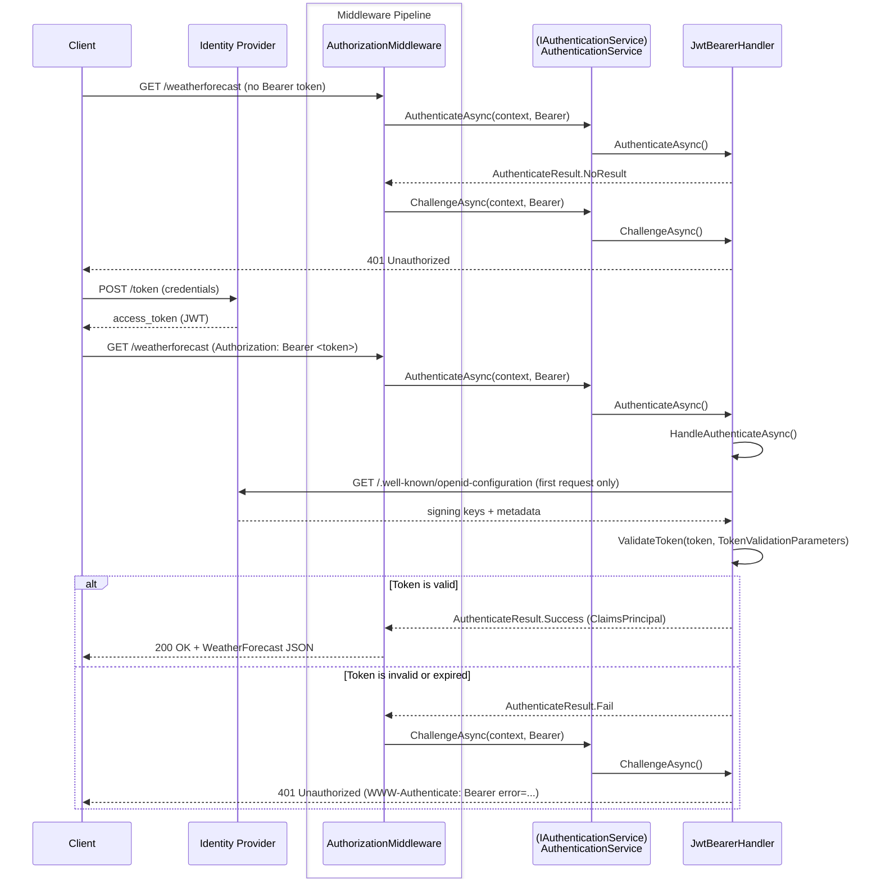

# Examples.Web.Authentication.JwtBearer

## Table of Contents <!-- omit in toc -->

- [Microsoft.AspNetCore.Authentication.JwtBearer](#microsoftaspnetcoreauthenticationjwtbearer)
  - [Set up this project](#set-up-this-project)
    - [1. Set up authentication (Program.cs)](#1-set-up-authentication-programcs)
    - [2. Set up authorization (Program.cs)](#2-set-up-authorization-programcs)
    - [3. Set up middleware pipeline (Program.cs)](#3-set-up-middleware-pipeline-programcs)
    - [4. Configure appsettings.json](#4-configure-appsettingsjson)
  - [Authentication flows](#authentication-flows)
- [Scenarios](#scenarios)
  - [1. Local testing with `dotnet user-jwts`](#1-local-testing-with-dotnet-user-jwts)
    - [1.1. Set up Authorization](#11-set-up-authorization)
    - [1.2. Create a token](#12-create-a-token)
    - [1.3. Call the API](#13-call-the-api)
  - [2. JWT Bearer authentication with Auth0](#2-jwt-bearer-authentication-with-auth0)
    - [2.1. Set up Auth0](#21-set-up-auth0)
    - [2.2. Set up Authorization](#22-set-up-authorization)
    - [2.3. Set in user-secrets](#23-set-in-user-secrets)
    - [2.4. Create a token](#24-create-a-token)
    - [2.5. Call the API](#25-call-the-api)
  - [3. Simulating OIDC JWT authentication with a custom JWKS endpoint](#3-simulating-oidc-jwt-authentication-with-a-custom-jwks-endpoint)
    - [3.1. Create JWKS](#31-create-jwks)
    - [3.2. Configure the Discovery Document](#32-configure-the-discovery-document)
    - [3.3. Set up Authorization](#33-set-up-authorization)
    - [3.4. Generate an access token](#34-generate-an-access-token)
  - [4. Custom AuthenticationHandler - Blacklist JWT Handler](#4-custom-authenticationhandler---blacklist-jwt-handler)
    - [4.1. Implement `AuthenticationHandler<TOptions>`](#41-implement-authenticationhandlertoptions)
    - [4.2. Set up Authentication](#42-set-up-authentication)
    - [4.3. Create a token](#43-create-a-token)
    - [4.4. Register a token in the blacklist](#44-register-a-token-in-the-blacklist)
  - [5. Automatically select multiple authentication schemes](#5-automatically-select-multiple-authentication-schemes)
- [Development](#development)
  - [Build](#build)
  - [Run](#run)
  - [How the project was initialized](#how-the-project-was-initialized)
- [References](#references)

## Microsoft.AspNetCore.Authentication.JwtBearer

Contains types that support JWT Bearer token authentication.

JWT Bearer authentication validates incoming `Authorization: Bearer <token>` headers.
The token is verified against the identity provider's signing keys and the configured validation parameters.

### Set up this project

#### 1. Set up authentication (Program.cs)

Add the following to `Program.cs`:

```cs
builder.Services.AddAuthentication(JwtBearerDefaults.AuthenticationScheme)
    .AddJwtBearer(jwtOptions =>
    {
        jwtOptions.Authority = "https://{--your-authority--}";
        jwtOptions.Audience = "https://{--your-audience--}";
    })
    .AddJwtBearer("some-scheme", jwtOptions =>
    {
        jwtOptions.MetadataAddress = builder.Configuration["Api:MetadataAddress"]!;
        jwtOptions.Authority = builder.Configuration["Api:Authority"];
        jwtOptions.Audience = builder.Configuration["Api:Audience"];
        jwtOptions.TokenValidationParameters = new TokenValidationParameters
        {
            ValidateIssuer = true,
            ValidateAudience = true,
            ValidateIssuerSigningKey = true,
            ValidAudiences = builder.Configuration.GetSection("Api:ValidAudiences").Get<string[]>(),
            ValidIssuers = builder.Configuration.GetSection("Api:ValidIssuers").Get<string[]>()
        };
        jwtOptions.MapInboundClaims = false;
    });
```

Two JWT Bearer schemes are registered:

| Scheme | Description |
|--------|-------------|
| `Bearer` (default) | Hardcoded `Authority` and `Audience` for a quick demo. |
| `some-scheme` | Reads all settings from configuration. Uses `MetadataAddress` for OIDC discovery and explicit `TokenValidationParameters`. `MapInboundClaims = false` preserves original JWT claim names (e.g. `sub` instead of `ClaimTypes.NameIdentifier`).  |

> [!NOTE]
> `MetadataAddress` points to the OIDC discovery document (`.well-known/openid-configuration`).
> When it is specified, `Authority` is optional but can be used for issuer validation.

#### 2. Set up authorization (Program.cs)

A fallback policy is applied so that all endpoints require authentication by default:

```cs
var requireAuthPolicy = new AuthorizationPolicyBuilder()
    .RequireAuthenticatedUser()
    .Build();

builder.Services.AddAuthorizationBuilder()
    .SetFallbackPolicy(requireAuthPolicy);
```

> [!NOTE]
> Endpoints can opt out with `.AllowAnonymous()`.
> In this project, the OpenAPI and Scalar API Reference endpoints are exempted.

#### 3. Set up middleware pipeline (Program.cs)

```cs
app.UseHttpsRedirection();
app.UseAuthentication();
app.UseAuthorization();
```

#### 4. Configure appsettings.json

The `some-scheme` handler reads its settings from the `Api` section in `appsettings.json`:

```json
{
  "Api": {
    "MetadataAddress": "https://{--your-issuer--}/.well-known/openid-configuration",
    "Authority": "https://{--your-issuer--}",
    "Audience": "https://{--your-audience--}",
    "ValidAudiences": [ "https://{--your-audience--}" ],
    "ValidIssuers": [ "https://{--your-issuer--}" ]
  }
}
```

> [!WARNING]
> Never commit real authority URLs, client IDs, or secrets.
> Use user-secrets or environment variables for sensitive values.

### Authentication flows



## Scenarios

### 1. Local testing with `dotnet user-jwts`

`dotnet user-jwts` issues a signed JWT locally without an external identity provider.
It writes the signing key and issuer into user-secrets under `Authentication:Schemes:Bearer:SigningKeys:*`.
`AddJwtBearer()` with no arguments reads these keys automatically in Development.

#### 1.1. Set up Authorization

Call `AddJwtBearer()` with no options for the default Bearer scheme:

Modify `Program.cs`:

```cs
builder.Services.AddAuthentication(JwtBearerDefaults.AuthenticationScheme)
    .AddJwtBearer();
```

#### 1.2. Create a token

```shell
dotnet user-jwts create --project src/Examples.Web.Authentication.JwtBearer/
```

The command prints the token and updates user-secrets. Copy the token value from the output.

#### 1.3. Call the API

```shell
curl -sk -H "Authorization: Bearer <token>" https://localhost:7053/weatherforecast | jq .
```

Or paste the token into the **Authorize** dialog on the Scalar API Reference page (`/scalar/v1`).

### 2. JWT Bearer authentication with Auth0

#### 2.1. Set up Auth0

1. Open the Auth0 Dashboard and go to [Applications] > [APIs] > click [Create API]
2. Fill in the API details:
   - Name: any descriptive name (e.g. `My ASP.NET Core API`)
   - Identifier (Audience): a unique URI for the API (e.g. `https://examples-dotnet.com`)
   - Signing Algorithm: leave the default RS256 (RSA-SHA256)
3. Save the settings
4. Note the `Authority` and `Audience` values shown in the Quickstart tab

#### 2.2. Set up Authorization

Call `AddJwtBearer()`

Modify `Program.cs`:

```cs
builder.Services.AddAuthentication(JwtBearerDefaults.AuthenticationScheme)
    .AddJwtBearer("Auth0", jwtOptions =>
    {
        jwtOptions.Authority = builder.Configuration["Authentication:Schemes:Auth0:Authority"];
        jwtOptions.Audience = builder.Configuration["Authentication:Schemes:Auth0:Audience"];
        jwtOptions.TokenValidationParameters = new TokenValidationParameters
        {
            NameClaimType = System.Security.Claims.ClaimTypes.NameIdentifier,
            RoleClaimType = "https://my-app.example.com/roles",
        };
    });
```

The scheme name `Auth0` is used to distinguish it from other schemes registered in this project.

#### 2.3. Set in user-secrets

```shell
dotnet user-secrets set "Authentication:Schemes:Auth0:Authority" "{Set Authority from Auth0}"
dotnet user-secrets set "Authentication:Schemes:Auth0:Audience" "{Set Audience from Auth0}"
```

#### 2.4. Create a token

1. Open the Auth0 Dashboard and go to [Applications] > [APIs].
2. Select the API you created (e.g. `My ASP.NET Core API`).
3. Click the [Test] tab and copy the `access_token` value shown in the Response section or the curl example.

#### 2.5. Call the API

```shell
curl -sk -H "Authorization: Bearer <token>" https://localhost:7053/hello-auth0 | jq .
```

### 3. Simulating OIDC JWT authentication with a custom JWKS endpoint

#### 3.1. Create JWKS

The tool details are not covered here.

```shell
dotnet run --no-launch-profile --project src/fixtures/Examples.Web.Generator.JwtToken/ -- jwks -f assets/example.signer.crt  --with-x5c > src/Examples.Web.Authentication.JwtBearer/jwks.json
```

#### 3.2. Configure the Discovery Document

Configure the OIDC endpoint that `JwtBearerHandler` accesses by default.
Specifically, the Discovery Document (`.well-known/openid-configuration`) is fetched first, and then the `jwks_uri` URL from that document is used to retrieve the JWKS. Serve both locally.

Modify `Program.cs`:

```cs
app.UseHttpsRedirection();
app.UseAuthentication();
app.UseAuthorization();

// ...

app.MapWellKnownEndpoints();

app.Run();
```

#### 3.3. Set up Authorization

Modify `Program.cs`:

```cs
builder.Services.AddAuthentication(JwtBearerDefaults.AuthenticationScheme)
    .AddJwtBearer("FakeOidc")
    ;
```

Prefer configuring via `appsettings.json` (or `appsettings.Development.json`) rather than hardcoding in code.

```json
      "FakeOidc": {
        "ValidAudience": "my-api",
        "Authority": "https://localhost:7053/"
      }
```

`ValidAudience` was preferred over `Audience` because the latter is not read from configuration in this context.
Also, using `ValidIssuer` instead of `Authority` prevented the Discovery Document from being fetched.

> [!WARNING]
> ASP.NET development uses a self-signed certificate, so the above request will fail with a certificate error. You must allow the self-signed certificate during development.

```cs
if (builder.Environment.IsDevelopment())
{
    builder.Services.Configure<JwtBearerOptions>("FakeOidc", options =>
    {
        // This is important: Pass SSL verification in internal communications.
        options.BackchannelHttpHandler = new HttpClientHandler
        {
            // Allow self-signed certificates for local development only.
            ServerCertificateCustomValidationCallback = (message, cert, chain, errors) => true
        };
    });
}
```

#### 3.4. Generate an access token

The JWT must be signed with the same certificate that is served by the JWKS endpoint.

```shell
dotnet run --no-launch-profile --project src/fixtures/Examples.Web.Generator.JwtToken/ -- sign -f assets/example.signer.p12 -p "$(cat assets/.password)" --iss https://localhost:7053/ 
```

Use the generated token to call the API.
You can inspect the token contents at [JSON Web Tokens - jwt.io](https://www.jwt.io/).

### 4. Custom AuthenticationHandler - Blacklist JWT Handler

#### 4.1. Implement `AuthenticationHandler<TOptions>`

First, create a class derived from `AuthenticationSchemeOptions`. In this case, no additional implementation is needed.

```cs
public class RevocableJwtOptions : AuthenticationSchemeOptions
{
}
```

Next, create the corresponding authentication handler.

```cs
public class RevocableJwtHandler(
    IOptionsMonitor<RevocableJwtOptions> options,
    ILoggerFactory logger,
    UrlEncoder encoder,
    IConfiguration configuration,
    ITokenBlacklistService blacklistService
) : AuthenticationHandler<RevocableJwtOptions>(options, logger, encoder)
{
    protected override async Task<AuthenticateResult> HandleAuthenticateAsync()
    {
        //...
    }
}
```

The core logic is in `HandleAuthenticateAsync()`.
This simplified implementation reads the `Authorization` header from the request to extract the Bearer token.
It first validates the token's signature and expiry using `JsonWebTokenHandler`, then checks whether the token is on the blacklist.

The tokens validated by `JsonWebTokenHandler` are also generated with `dotnet user-jwts`.

See the source code for full details.

#### 4.2. Set up Authentication

An extension method is provided for registration.

Modify `Program.cs`:

```cs
builder.Services.AddAuthentication(JwtBearerDefaults.AuthenticationScheme)
    .AddRevocableJwtBearer("RevocableJwt")
    ;

builder.Services.Configure<JwtBlacklistOptions>(
    builder.Configuration.GetSection("Authentication:JwtBlacklistOptions"));
```

#### 4.3. Create a token

Generate a token using `dotnet user-jwts`:

```shell
dotnet user-jwts create
```

Verify that the signing key was also generated:

```shell
dotnet user-secrets list 
```

#### 4.4. Register a token in the blacklist

The token blacklist is managed simply via `appsettings.json` (or `appsettings.Development.json`).
To verify that authentication fails for a revoked token, add its `jti` claim value to the list shown below while the application is running.

```json
"Authentication": {
    "JwtBlacklistOptions": {
      "RevokedJtiList": [
        "example-revoked-jti-1",
        "example-revoked-jti-2"
      ]
    }
  }
```

### 5. Automatically select multiple authentication schemes

By using `ForwardDefaultSelector`, you can automatically select multiple authentication schemes.

```cs
.AddPolicyScheme("Aggregate", "Aggregate Policy", options =>
    {
        options.ForwardDefaultSelector = context =>
        {
            // Logic to select the appropriate scheme based on the request

            return JwtBearerDefaults.AuthenticationScheme; // Default scheme
        };
    });
```

## Development

### Build

Build this project from the repository root:

```shell
dotnet build src/Examples.Web.Authentication.JwtBearer/
```

### Run

Run this project from the repository root:

```shell
dotnet run --project src/Examples.Web.Authentication.JwtBearer/ -lp https
```

### How the project was initialized

This project was initialized with the following commands:

```shell
## Solution
dotnet new sln -o .

## Project
dotnet new webapi -o src/Examples.Web.Authentication.JwtBearer
dotnet sln add src/Examples.Web.Authentication.JwtBearer/
cd src/Examples.Web.Authentication.JwtBearer
dotnet add reference ../Examples.Web.Infrastructure/
dotnet add package Microsoft.AspNetCore.Authentication.JwtBearer
dotnet add package Microsoft.Extensions.ApiDescription.Server
dotnet add package Swashbuckle.AspNetCore.SwaggerUI
dotnet add package Scalar.AspNetCore

dotnet user-secrets init
cd ../../

# Check outdated packages
dotnet list package --outdated
```

## References

- [JWT Bearer authentication in ASP.NET Core | Microsoft Learn](https://learn.microsoft.com/ja-jp/aspnet/core/security/authentication/jwt-authn)
- [Overview of ASP.NET Core authentication | Microsoft Learn](https://learn.microsoft.com/ja-jp/aspnet/core/security/authentication/)
